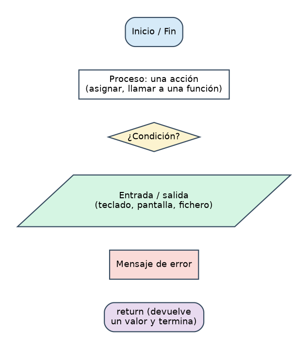
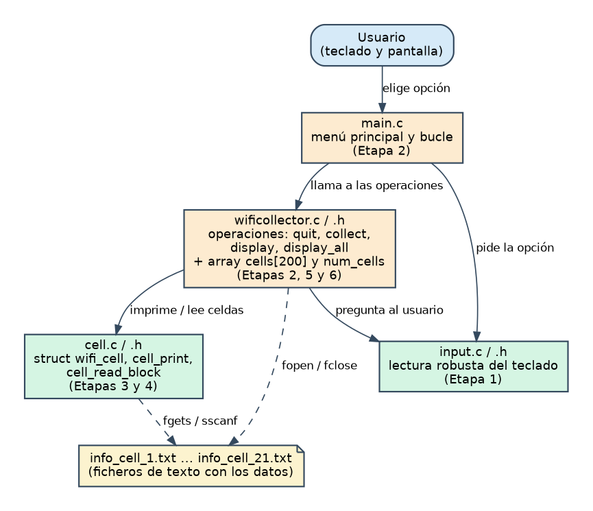
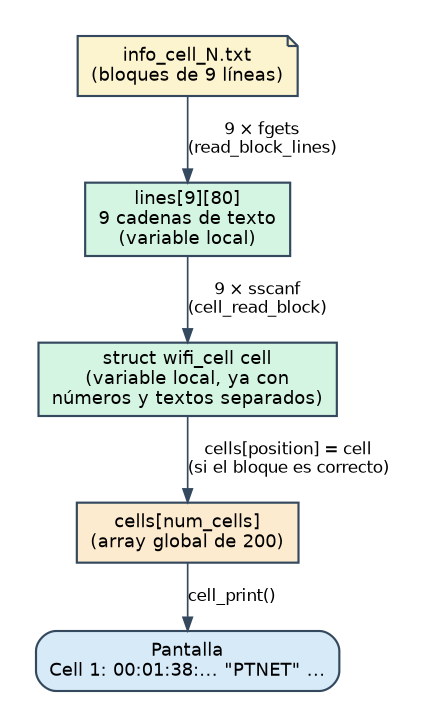
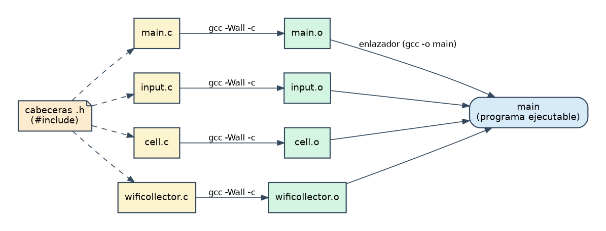

# Recolector de redes inalámbricas · Fase 1

*Guía paso a paso para aprender C construyendo la Entrega 1 · Arquitectura de Sistemas 2026-2027*

# Empieza aquí

## Qué vas a construir

Un programa de terminal en C con un menú. Para la **Entrega 1** (Fase 1) basta con cuatro operaciones:

| Opción | Operación | Qué hace |
|:--:|---|---|
| 1 | `wificollector_quit` | Pregunta si de verdad quieres salir |
| 2 | `wificollector_collect` | Lee un fichero `info_cell_N.txt` y añade sus puntos de acceso a un array |
| 9 | `wificollector_display` | Imprime los puntos de acceso de la celda que elijas |
| 10 | `wificollector_display_all` | Imprime todos los puntos de acceso guardados |

Restricciones de la Fase 1 (del enunciado y de lo que me has pedido):

- **Array de tamaño fijo, máximo 200 elementos.** Cadenas de texto de **80 caracteres como máximo**.
- Sin arrays dinámicos ni memoria dinámica (`malloc`/`realloc` llegan en la Entrega 2).
- **Si no compila con `gcc -Wall` sin errores ni advertencias, la nota es 0.** Por eso en cada etapa compilarás con ese flag.
- Código dividido en ficheros, documentado y escrito siguiendo la *Guía de estilo*.
- Se entrega un `.zip` con: ficheros de entrada, código fuente, `Makefile` y `README`. Tiene que compilar con `make` y ejecutarse con `./main`, y funcionar en los laboratorios o máquinas virtuales de la UC3M.
- **Fecha límite según el enunciado: viernes 16 de octubre de 2026, 23:55** (Aula Global).

## Cómo usar esta guía (el método)

El objetivo no es solo entregar: es que dentro de unas semanas puedas escribir esto **sin ayuda**. Para eso, cada etapa sigue el mismo ciclo:

1. **Lee** el objetivo y la teoría (son cortas y van al grano).
2. **Mira el diagrama** de flujo: es el "plano" de lo que vas a escribir.
3. **Intenta tú** escribir el código usando solo la *ficha* de la etapa (nombres de funciones y qué debe hacer cada una). Si te atascas, usa las **pistas** en orden.
4. **Compila con `-Wall` y prueba** con la tabla de pruebas de la etapa.
5. **Compara** con mi solución de referencia (desplegable al final de cada etapa, o la carpeta `etapa_N/`). No busques que sea idéntica: busca **entender cada diferencia**.
6. **Reescribe sin mirar** la función más difícil de la etapa. Si te sale, lo has aprendido; si no, vuelve a la teoría.

> **Regla de oro:** escribe todo a mano, aunque tengas la solución delante. Copiar y pegar te da un programa; teclear, equivocarte y arreglarlo te da la habilidad que necesitarás en los exámenes.

> **No mires las etapas siguientes** hasta terminar la actual. Cada carpeta `etapa_N/` es un programa completo que compila y funciona, para que puedas comparar o retomar desde ahí si algo se rompe.

## Mapa de etapas

| Etapa | Qué construyes | Conceptos de C que aprendes | Carpeta |
|:--:|---|---|---|
| 0 | Preparación y mapa del proyecto | Cómo se compila un programa, módulos, estilo | — |
| 1 | `input.c/.h`: leer del teclado sin que nada se rompa | cadenas, `fgets`, `sscanf`, `EOF`, parámetros array | `etapa_1/` |
| 2 | Menú principal, bucle y `quit` + `Makefile` | `while`, `switch`, `enum`, `static`, varios ficheros, `make` | `etapa_2/` |
| 3 | La estructura `wifi_cell` y mostrar una celda | `struct`, `strcpy`, `printf`, arrays de structs | `etapa_3/` |
| 4 | Leer un bloque de un fichero de texto | ficheros, `FILE *`, `fopen`, scansets, arrays 2D, `enum` de estado | `etapa_4/` |
| 5 | `wificollector_collect` | estado de módulo, límites de un array, `snprintf`, descomponer en funciones | `etapa_5/` |
| 6 | `display` y `display_all` | búsqueda lineal, contar, reutilizar funciones | `etapa_6/` |
| 7 | Pruebas, estilo y entrega | probar con redirección, revisar estilo, `README`, `zip` | `etapa_7_entrega_final/` |

## Ritmo sugerido (hoy es martes 6 de octubre)

| Cuándo | Etapa |
|---|---|
| Mar 6 – Mié 7 oct | 0 y 1 |
| Jue 8 | 2 |
| Vie 9 | 3 |
| Sáb 10 – Dom 11 | 4 (la más densa en conceptos nuevos) |
| Lun 12 – Mar 13 | 5 |
| Mié 14 | 6 |
| Jue 15 | 7: pruebas, estilo, README, zip |
| Vie 16 | Colchón. Entrega con margen, **no a las 23:50** |

> Si trabajas en equipo (el enunciado pide equipos de 3 y contribución equilibrada), una buena idea es que los tres hagáis las etapas 1-4 por separado —así aprendéis los tres— y luego decidáis juntos con qué versión os quedáis.

## Qué contiene el paquete

```
wificollector_fase1/
├── GUIA_Fase1.html          ← esta guía en una sola página (se lee en el navegador)
├── guia/                    ← la misma guía en ficheros Markdown, una etapa por fichero
├── diagramas/               ← todos los diagramas (PNG para ver, SVG para ampliar, DOT = código fuente)
├── etapa_1/ … etapa_6/      ← el programa tal y como queda al terminar cada etapa
└── etapa_7_entrega_final/   ← versión final: código, Makefile, README (plantilla), tests y datos
```

## Cómo leer los diagramas



## Una nota honesta sobre "sin punteros"

En la Fase 1 **no declararás ninguna variable puntero, ni usarás `malloc`/`realloc`**. Pero C tiene tres sitios donde los punteros asoman aunque no los escribas, y es mejor que sepas qué son para que no te sorprendan:

1. **`FILE *`**: el tipo que devuelve `fopen`. Tendrás una variable `FILE *file`. Trátala como un "manillar" opaco: la pasas a `fgets` y `fclose`, y nunca miras dentro.
2. **El operador `&`** en `sscanf(line, "%d", &number)`: significa "la dirección de `number`" y le dice a `sscanf` *dónde escribir* el resultado. Sin él, `sscanf` no tendría forma de modificar tu variable.
3. **Los parámetros array** (`char line[]`): cuando pasas un array a una función, **no se copia**; la función recibe la dirección del original. Por eso `input_read_line(line, size)` puede rellenar tu `line`. Y también por eso, dentro de la función, `sizeof(line)` **no** te da el tamaño del array (por eso pasamos `size` aparte).

Todo esto se entenderá a fondo cuando lleguen los punteros y la memoria dinámica (Entregas 2 y 3). Por ahora, con "`&` = dónde escribir" y "los arrays se pasan sin copiar" tienes suficiente.

## Decisiones que he tomado (puedes cambiarlas)

El enunciado deja algunos detalles abiertos. Las he resuelto así y las documento también en el `README`:

- **Mensajes en español**, como el enunciado. (El ejemplo del mensaje de la Fase I está en inglés, pero dice expresamente que no hace falta el formato exacto.)
- **Sí/no:** se aceptan `s`, `S`, `n`, `N`. Cualquier otra cosa, incluida una línea vacía, se rechaza y se vuelve a preguntar.
- **`collect` no comprueba duplicados:** si recolectas dos veces la misma celda, se añade dos veces. El enunciado solo pide ignorar duplicados en `import`.
- **Si un bloque del fichero está mal formado**, se conservan los bloques anteriores ya añadidos, se avisa del error y se ignora el resto de ese fichero.
- **Si el array se llena** (200), se avisa y no se añade nada más.
- **Si se acaba la entrada** (Ctrl+D o fichero redirigido), el programa termina limpiamente en vez de quedarse en un bucle infinito.

> Si dudas de alguna de estas decisiones, pregúntala en tutoría: son exactamente el tipo de detalle que el cliente "puede ajustar durante el desarrollo" (aviso del enunciado).

# Etapa 0 · Preparación y mapa del proyecto

> **Objetivo:** entender qué hay que construir, cómo encajan las piezas y dejar el entorno listo. **No hay código que escribir hoy**, salvo un "hola mundo" de comprobación.

## 0.1 Los datos: de qué está hecho un fichero `info_cell_N.txt`

Cada fichero contiene uno o varios **bloques de 9 líneas**. Cada bloque es un punto de acceso wifi. Esto es `info_cell_5.txt` (3 bloques):

```
Cell 5
Address: 00:23:F8:B5:CD:22
ESSID:"WLAN_58"
Mode:Master
Channel:9
Encryption key:on
Quality=28/70
Frequency:2.452 GHz
Signal level=-82 dBm
Cell 5
Address: 00:1C:10:44:32:5B
...
```

He comprobado los 21 ficheros: todos tienen bloques de exactamente 9 líneas, sin líneas en blanco, la frecuencia siempre está en GHz y hay 47 bloques en total: las celdas 1 a 6 tienen 3 bloques, de la 7 a la 20 tienen 2 y la 21 tiene 1. Fíjate también en que un ESSID puede tener **espacios** (`"Miguel 3"`): lo tendrás en cuenta en la Etapa 4.

## 0.2 Vista general del programa



Cada recuadro es un **módulo**: una pareja `.c` (implementación) + `.h` (lo que ofrece a los demás). Las flechas dicen "usa a". Observa que `main.c` no sabe nada de ficheros ni de structs: solo pide opciones y llama a `wificollector_*`. Esa separación es la clave de un programa fácil de mantener.



Este segundo diagrama es el **corazón** del proyecto: el texto de un fichero se lee línea a línea, se trocea en campos (números y cadenas), se guarda en una `struct` y esa `struct` se copia a un array. Cuando termines la Etapa 6 entenderás cada flecha.

## 0.3 Teoría: cómo se convierte un `.c` en un programa



Compilar no es un solo paso:

1. **Preprocesador:** procesa las líneas que empiezan por `#`. `#include "input.h"` pega el contenido de ese fichero; `#define MAX 80` sustituye `MAX` por `80` en todo el texto.
2. **Compilador:** traduce cada `.c` por separado a código máquina (un fichero objeto `.o`). Aquí aparecen los **errores de sintaxis** y las **advertencias** (*warnings*). Para compilar el `.c` necesita *conocer* las funciones que usas, y eso lo consigue leyendo sus **prototipos** en los `.h`.
3. **Enlazador (*linker*):** junta todos los `.o` en el ejecutable y comprueba que cada función usada **existe** en algún `.o`. Aquí aparece el error `undefined reference to ...` cuando declaras una función en un `.h` pero nunca la escribes.

¿Por qué separar en módulos? Porque si cambias un solo `.c`, solo se recompila ese; y porque cada módulo se puede probar por separado (lo harás en las etapas 1, 3 y 4).

**`-Wall`** activa casi todas las advertencias útiles (variables sin usar, formatos de `printf` incorrectos, funciones sin declarar...). Un *warning* suele ser un error real que el compilador te perdona. En esta asignatura **cero advertencias** es obligatorio.

## 0.4 Requisitos de la empresa y dónde se cumplen

| Requisito (enunciado) | Cómo lo cumpliremos |
|---|---|
| `company_require_divided` | Módulos `input`, `cell`, `wificollector` y `main`, con nombres descriptivos |
| `company_require_documented` | Comentario sobre **cada** función, `#define`, `struct`, `enum` y variable global |
| `company_require_gccclean` | Compilar siempre con `gcc -Wall`; cero advertencias |
| `company_require_style` | Resumen de la guía en la tabla de abajo; revisión en la Etapa 7 |
| `company_require_noleaks` | No aplica aún (sin memoria dinámica): llegará en la Entrega 2 |
| Compila en laboratorios/VM UC3M | Pruébalo allí en la Etapa 7, **no el último día** |

## 0.5 La *Guía de estilo*, resumida

Tenla a mano en cada etapa. (Es un resumen del documento oficial de la asignatura; ante la duda, manda el original.)

| Regla | Qué dice | Ejemplo |
|:--:|---|---|
| A1 | Nombres cortos, descriptivos y concretos | `input_ask_number`, no `f2` |
| A2 | Variables y funciones en minúsculas con `_` | `num_cells`, `print_menu` |
| A3 | Macros y constantes en MAYÚSCULAS | `#define WFC_MAX_CELLS 200` |
| A4 | Constantes y enumerados públicos con prefijo de 3-4 letras del módulo | `INP_EOF`, `CEL_MAX_STR`, `WFC_…` |
| B1 | Sangría con **tabuladores** (editor configurado a 4 espacios), nunca espacios | — |
| B2 | Llaves en estilo Allman: la `{` en su propia línea | ver abajo |
| B3 | Espacio alrededor de operadores y tras `if`, `for`, `while`, `return` | `if (a == b)` |
| B4 | Una función debe caber en pantalla (nunca más de dos pantallas) | — |
| B5 | Líneas de **80 caracteres como máximo** | — |
| C1 | Tamaños de array con macros, no con números sueltos | `char line[INP_MAX_LINE];` |
| D1 | Comentario encima de **toda** función (qué hace, en 1-2 líneas) | ver abajo |
| D2 | Comentar las partes no triviales, no cada línea | — |
| E1-E3 | Cada `.c` tiene su `.h` y lo incluye el primero | `input.c` → `#include "input.h"` |
| E4 | El `.h` solo lleva lo público: tipos, constantes, prototipos | — |
| E5 | Guarda en todo `.h`: `#ifndef _X_H_` / `#define _X_H_` / `#endif` | — |
| E6 | El `.h` incluye solo lo imprescindible para compilar solo | — |
| E7 | Lo privado es `static`; las globales, juntas al principio del `.c` | — |

```c
/*
 * db_sync()
 * Comentario encima de la función: qué hace, en una o dos líneas.
 */
int db_sync(void)
{
	int i;

	for (i = 0; i < 10; i++)
	{
		if (i == 5)
		{
			continue;
		}
	}

	return i;
}
```

## 0.6 Tu tarea de hoy

1. Crea una carpeta de trabajo, por ejemplo `wificollector/`, y **copia dentro los 21 ficheros** `info_cell_N.txt`.
2. Comprueba que tienes `gcc` y `make`:
   ```
   gcc --version
   make --version
   ```
3. **Configura tu editor** para que el tabulador sea un tabulador de ancho 4. En VS Code: abre *Settings* y pon `editor.insertSpaces` en **falso**, `editor.tabSize` en **4** y `editor.detectIndentation` en **falso**. Añade también `editor.rulers: [80]` para ver una raya en la columna 80.
4. Escribe y compila un programa mínimo, y **provoca una advertencia a propósito** para ver cómo es:

   ```c
   #include <stdio.h>

   int main(void)
   {
   	int unused;

   	printf("Hola\n");
   	return 0;
   }
   ```
   Compila con `gcc -Wall -o hola hola.c` y lee el mensaje (`unused variable`). Bórrala y vuelve a compilar: silencio total es lo que buscamos.

## 0.7 Recursos

- Compilación y avisos: [Opciones de aviso de GCC](https://gcc.gnu.org/onlinedocs/gcc/Warning-Options.html)
- Para empezar con el lenguaje (gratis, en inglés, muy claro): [Beej's Guide to C Programming](https://beej.us/guide/bgc/) · y su [referencia de funciones de la librería estándar](https://beej.us/guide/bgclr/)
- Estilo de llaves: [Estilo Allman](https://en.wikipedia.org/wiki/Indentation_style#Allman_style)
- Libro clásico: *El lenguaje de programación C*, de Kernighan y Ritchie.
- En tu terminal tienes un manual de cada función: `man 3 fgets`, `man 3 sscanf`… (sal con `q`).

> Los enlaces apuntan a documentación oficial; si alguno cambia, busca el nombre de la función en [cppreference.com](https://en.cppreference.com/w/c).

## 0.8 Lista de comprobación

- [ ] Tengo la carpeta con los 21 ficheros de datos
- [ ] `gcc` y `make` funcionan
- [ ] El editor usa tabuladores de ancho 4 y tengo la raya de la columna 80
- [ ] He visto una advertencia de `-Wall` y sé leerla
- [ ] Puedo explicar con mis palabras qué hace el compilador y qué hace el enlazador
