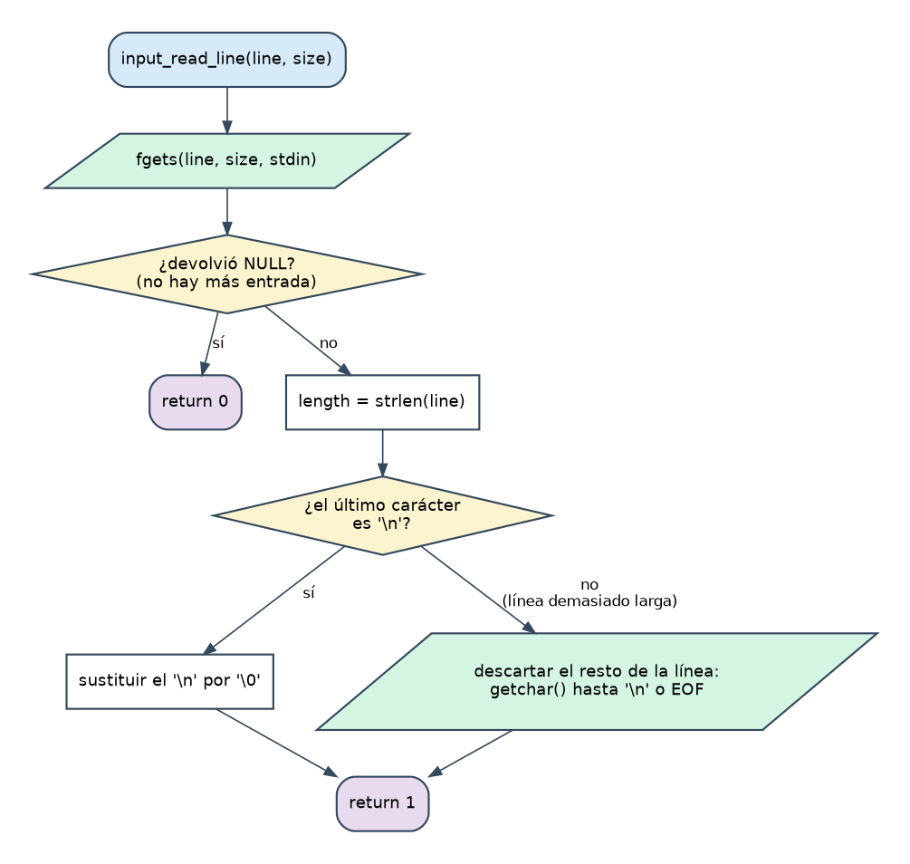
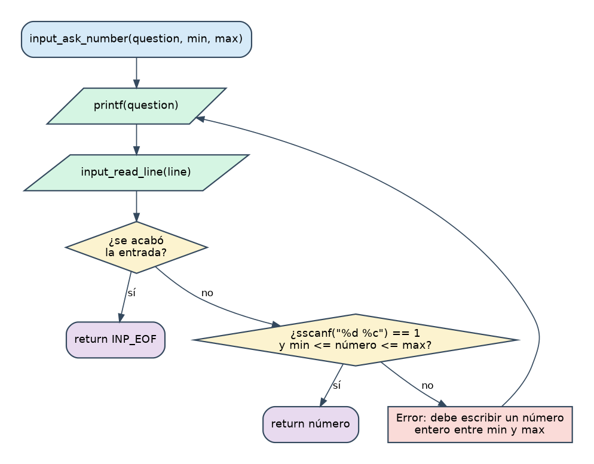
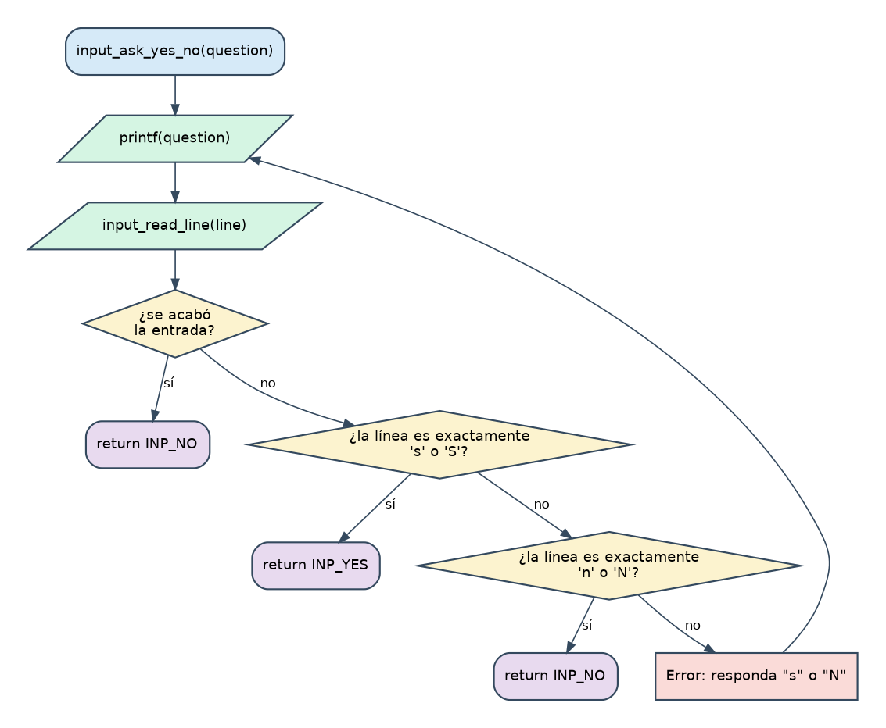

# Etapa 1 · Leer del teclado sin que el programa se rompa

> **Objetivo:** crear el módulo `input` (`input.h` + `input.c`) con tres funciones que lean números y respuestas sí/no **sin fallar nunca**, pase lo que pase en el teclado.
> **Dificultad:** media. **Tiempo orientativo:** 1-2 sesiones.

El enunciado insiste: *"la aplicación debe ser robusta: letras cuando se espera un número, una cadena vacía, una línea vacía…"*. Si dejas esto bien hecho **ahora**, todas las demás etapas se apoyan en ello y no tendrás que preocuparte más del teclado.

## 1.1 Teoría

### Cadenas de texto en C

C no tiene un tipo "texto". Una **cadena** es un array de `char` que termina en un carácter especial `'\0'` (el *terminador*, valor 0).

```c
char line[80];   /* reserva 80 bytes: caben 79 letras + el '\0' */
```

- `"a"` (comillas dobles) es una cadena: dos bytes, `'a'` y `'\0'`. `'a'` (comillas simples) es un solo carácter. No son lo mismo.
- `strlen(line)` (de `<string.h>`) cuenta cuántos caracteres hay **antes** del `'\0'`.
- Un array no se puede asignar con `=` ni comparar con `==`. Para copiar y comparar cadenas hay funciones (`strcpy`, `strcmp`); las verás en las etapas siguientes.

### Por qué NO usar `scanf` para leer del teclado

`scanf("%d", &n)` parece cómodo, pero tiene tres problemas serios:

1. **Deja el salto de línea (`\n`) sin leer**, que "contamina" la siguiente lectura.
2. **Si escribes texto donde espera un número** (`abc`), `scanf` falla *sin consumir* esas letras. Si lo metes en un bucle "repite hasta que sea válido", **se vuelve infinito**: lee `abc`, falla, lo vuelve a intentar con las mismas `abc`, falla...
3. Con `%s` y sin límite de anchura, **escribe más allá del array** (desbordamiento de buffer), uno de los fallos de seguridad más famosos de la historia.

La estrategia robusta es siempre la misma: **(1) leer una línea entera como texto, (2) analizarla con calma**.

### `fgets`: leer una línea entera

```c
char *fgets(char *buffer, int size, FILE *stream);
```

Lee como máximo `size - 1` caracteres de `stream` (para el teclado, `stdin`), se detiene tras el `'\n'` (que **se guarda** en el buffer) y añade el `'\0'`. Devuelve `NULL` si no pudo leer nada (fin de la entrada). `NULL` significa "nada / no hay"; de momento solo necesitas saber compararlo: `if (fgets(...) == NULL)`.

Dos situaciones a vigilar:

- **La línea cabe:** el buffer acaba en `"...\n\0"`. Hay que quitar el `\n` (poner un `'\0'` en su lugar).
- **La línea es demasiado larga:** `fgets` solo coge `size - 1` caracteres y el **resto se queda esperando** en el teclado, y se lo comerá la siguiente lectura. Hay que descartarlo leyendo con `getchar()` hasta encontrar `'\n'` o `EOF`.

### `sscanf`: analizar un texto que ya tienes

`sscanf` es `scanf` pero leyendo de una cadena en vez del teclado:

```c
int sscanf(const char *text, const char *format, ...);
```

Devuelve **cuántos datos consiguió convertir**. Eso es justo lo que necesitas para validar:

| Texto | `sscanf(text, "%d", &n)` devuelve |
|---|:--:|
| `"12"` | 1 (convirtió el número) |
| `"abc"` | 0 (no pudo convertir) |
| `""` (vacío) | -1 = `EOF` (no había nada) |
| `"12abc"` | 1 (¡acepta el 12 y se olvida de `abc`!) |

Ese último caso es un problema: `12abc` no debería ser válido. **El truco** es pedir a continuación un carácter extra con `"%d %c"`:

| Texto | `sscanf(text, "%d %c", &n, &extra)` | ¿Válido? |
|---|:--:|:--:|
| `"12"` | 1 | sí |
| `"  7  "` | 1 | sí (el espacio del formato se come blancos) |
| `"12abc"` | 2 (encontró un `a` detrás) | **no** |
| `"5 6"` | 2 | **no** |

Es decir: el número es válido **solo si `sscanf` devuelve exactamente 1**. Luego se comprueba el rango (`min <= n <= max`).

> El `&` delante de `n` es el operador "dirección de": le dice a `sscanf` *dónde* guardar el resultado (ver la nota "sin punteros" de la portada).

### `EOF`: cuando se acaba la entrada

Con **Ctrl+D** (Linux/Mac; Ctrl+Z+Enter en Windows) cierras la entrada de teclado. Lo mismo ocurre cuando ejecutas `./main < pruebas.txt` y el fichero se acaba. `fgets` devuelve entonces `NULL`. **Si tu bucle de "repite hasta que sea válido" no contempla esto, se queda dando vueltas para siempre.** Por eso nuestras funciones devuelven un valor especial (`INP_EOF`) cuando la entrada se acaba.

### Parámetros que son arrays

```c
int input_read_line(char line[], int size);
```

El array **no se copia**: la función trabaja sobre el array original de quien la llama (por eso puede rellenarlo). Por eso también hay que pasar `size` aparte. Y `const char question[]` es la promesa de "solo lo leeré, no lo modificaré".

### Módulos: `.h` y `.c`

Es tu primer módulo. Recuerda las reglas E1-E7 de la guía de estilo: el `.h` lleva la **guarda** (`#ifndef _INPUT_H_ ... #endif`, para que incluirlo dos veces no dé error) y solo lo público; el `.c` incluye su propio `.h` y declara sus macros privadas. Las macros públicas llevan el prefijo del módulo: `INP_`.

## 1.2 Diagramas de flujo







## 1.3 Ficha: lo que debes escribir

**`input.h`** (con guarda y todo documentado) declara:

| Elemento | Descripción |
|---|---|
| `INP_EOF` | Macro con valor `-1`: lo que devuelve `input_ask_number` si se acaba la entrada |
| `INP_NO`, `INP_YES` | Macros con valores `0` y `1` |
| `int input_read_line(char line[], int size)` | Lee una línea del teclado en `line`, **sin** el `\n`. Si era demasiado larga, descarta el resto. Devuelve **1** si leyó algo y **0** si se acabó la entrada |
| `int input_ask_number(const char question[], int min, int max)` | Muestra `question`; repite hasta que el usuario escribe **un único número entero** entre `min` y `max`. Si se acaba la entrada devuelve `INP_EOF` |
| `int input_ask_yes_no(const char question[])` | Muestra `question`; acepta `s`/`S` (→ `INP_YES`) y `n`/`N` (→ `INP_NO`) y **nada más** (ni líneas vacías). Si se acaba la entrada, devuelve `INP_NO` |

Cuando algo no es válido, escribe un mensaje de error claro y **vuelve a preguntar**.

**`input.c`** implementa las tres funciones. Necesitarás `#include <stdio.h>` y `<string.h>`, y una macro privada `INP_MAX_LINE` (80) para el tamaño de tus buffers.

**`test_input.c`**: un programa de prueba con su propio `main` que pide un número entre 1 y 21 y una respuesta sí/no, y los imprime. Los programas de prueba son una herramienta profesional: probar un módulo **aislado** antes de usarlo.

Compilar a mano (el `Makefile` llega en la Etapa 2):

```
gcc -Wall -o test_input test_input.c input.c
./test_input
```

## 1.4 Pistas (ábrelas en orden, solo si te atascas)

> **Pista 1.** `input_ask_number` y `input_ask_yes_no` tienen la misma forma: un bucle infinito (`while (1)`) que muestra la pregunta, lee una línea, y **si es válida hace `return`**; si no, muestra el error y el bucle da otra vuelta. Esto funciona porque `return` sale de la función aunque estés dentro del bucle.

> **Pista 2.** En `input_read_line`, tras `fgets`, mira el último carácter: `line[strlen(line) - 1]`. Si es `'\n'`, la línea cabía (bórralo). Si no, **o es una línea demasiado larga, o es la última línea del fichero sin `\n`**: en ambos casos, `getchar()` en bucle hasta `'\n'` o `EOF` es seguro.

> **Pista 3.** Para `sí/no` comprueba primero que `strlen(line) == 1` y después el carácter `line[0]`. Así `"si"` o `"nn"` no se aceptan.

## 1.5 Pruebas

Compila con `-Wall` (cero advertencias) y prueba cada fila de esta tabla con `test_input`:

| Escribes | Debe ocurrir |
|---|---|
| `abc` | Error y vuelve a preguntar (¡sin bucle infinito!) |
| *(solo Enter)* | Error y vuelve a preguntar |
| `0` y `22` | Error: fuera de 1-21 |
| `5 6` | Error |
| `12x` | Error |
| `  7  ` | Acepta el 7 |
| `7` | Acepta el 7 |
| 300 letras `a` y Enter | **Un** solo error; y la siguiente lectura no se contamina con restos |
| **Ctrl+D** en cualquier pregunta | El programa termina sin colgarse |
| Sí/no: `x`, `si`, *(vacío)* | Error y repregunta |
| Sí/no: `s`, `S`, `n`, `N` | Aceptado |

> **Truco de profesional:** puedes probar sin teclear nada con una tubería: `printf 'abc\n\n7\ns\n' | ./test_input`.

## 1.6 Errores típicos

- `warning: implicit declaration of function 'strlen'` → te falta `#include <string.h>`.
- Usar `=` en vez de `==` dentro de un `if` (`-Wall` te avisa si te fijas).
- Olvidar que `char line[80]` cabe **79** letras, no 80.
- Leer con `fgets` pero olvidar quitar el `\n`: luego `"s\n"` no es igual a `"s"`.
- `scanf` "por si acaso" en alguna parte: **un solo** `scanf` en el programa puede romper tu buen trabajo con `fgets`. No lo uses.

## 1.7 Limitación conocida (para que la conozcas)

Si el usuario escribe un número gigantesco (`99999999999999999999`), el estándar de C dice que `sscanf("%d")` tiene comportamiento indefinido. En la práctica, en Linux con `glibc` el valor se satura y nuestra comprobación de rango lo rechaza (lo he probado), pero la solución *estrictamente* correcta usa la función `strtol`, que requiere punteros. Queda anotado para cuando los veamos.

## 1.8 Solución de referencia

Intenta tú primero. Después, compara con `etapa_1/` o con estos ficheros:

<details>
<summary><strong>Ver mi solución: input.h, input.c y test_input.c</strong></summary>

**`etapa_1/input.h`**

```c
#ifndef _INPUT_H_
#define _INPUT_H_

/* Valor que devuelve input_ask_number() cuando se acaba la entrada de datos */
#define INP_EOF (-1)

/* Respuesta negativa de input_ask_yes_no() */
#define INP_NO 0

/* Respuesta afirmativa de input_ask_yes_no() */
#define INP_YES 1

/* Lee una línea del teclado sin el salto de línea. Devuelve 0 si no hay */
int input_read_line(char line[], int size);

/* Pide un entero entre min y max (incluidos) hasta que el usuario acierta */
int input_ask_number(const char question[], int min, int max);

/* Hace una pregunta de tipo sí/no. Devuelve INP_YES o INP_NO */
int input_ask_yes_no(const char question[]);

#endif /* _INPUT_H_ */
```

**`etapa_1/input.c`**

```c
#include <stdio.h>
#include <string.h>
#include "input.h"

/* Tamaño máximo de una línea leída del teclado (incluye el '\0' final) */
#define INP_MAX_LINE 80

/*
 * input_read_line()
 * Lee una línea del teclado y la guarda en "line" sin el salto de línea.
 * Si el usuario escribe más de "size - 1" caracteres, el resto se descarta
 * para que no contamine la siguiente lectura.
 * Devuelve 1 si se leyó una línea y 0 si se acabó la entrada (EOF).
 */
int input_read_line(char line[], int size)
{
	int length;
	int character;

	if (fgets(line, size, stdin) == NULL)
	{
		return 0;
	}

	length = strlen(line);
	if (length > 0 && line[length - 1] == '\n')
	{
		line[length - 1] = '\0';
	}
	else
	{
		/* La línea no cabía entera: se tira lo que sobra hasta el '\n' */
		character = getchar();
		while (character != '\n' && character != EOF)
		{
			character = getchar();
		}
	}

	return 1;
}

/*
 * input_ask_number()
 * Muestra "question" y pide un número entero entre "min" y "max" (incluidos).
 * Repite la pregunta hasta que la línea contiene un único número válido.
 * Devuelve el número, o INP_EOF si se acaba la entrada (por eso "min" debe
 * ser mayor o igual que 0).
 */
int input_ask_number(const char question[], int min, int max)
{
	char line[INP_MAX_LINE];
	char extra;
	int number;

	while (1)
	{
		printf("%s", question);
		if (!input_read_line(line, INP_MAX_LINE))
		{
			return INP_EOF;
		}

		/* sscanf devuelve 1 solo si hay un número y nada más detrás */
		if (sscanf(line, "%d %c", &number, &extra) == 1
			&& number >= min && number <= max)
		{
			return number;
		}

		printf("Error: debe escribir un número entero entre %d y %d.\n",
			min, max);
	}
}

/*
 * input_ask_yes_no()
 * Muestra "question" y espera "s" (sí) o "N" (no). También se aceptan "S" y
 * "n". Repite la pregunta hasta recibir una respuesta válida.
 * Devuelve INP_YES o INP_NO. Si se acaba la entrada, devuelve INP_NO.
 */
int input_ask_yes_no(const char question[])
{
	char line[INP_MAX_LINE];

	while (1)
	{
		printf("%s", question);
		if (!input_read_line(line, INP_MAX_LINE))
		{
			return INP_NO;
		}

		if (strlen(line) == 1 && (line[0] == 's' || line[0] == 'S'))
		{
			return INP_YES;
		}
		if (strlen(line) == 1 && (line[0] == 'n' || line[0] == 'N'))
		{
			return INP_NO;
		}

		printf("Error: responda \"s\" o \"N\".\n");
	}
}
```

**`etapa_1/test_input.c`**

```c
#include <stdio.h>
#include "input.h"

/*
 * main()
 * Programa de prueba del módulo input: pide un número y una respuesta sí/no.
 */
int main(void)
{
	int number;
	int answer;

	number = input_ask_number("Escriba un número entre 1 y 21: ", 1, 21);
	if (number == INP_EOF)
	{
		printf("\nSe acabó la entrada de datos.\n");
		return 0;
	}
	printf("Ha escrito el número %d\n", number);

	answer = input_ask_yes_no("¿Le gusta programar en C? [s/N]: ");
	if (answer == INP_YES)
	{
		printf("¡Estupendo!\n");
	}
	else
	{
		printf("Ya le gustará.\n");
	}

	return 0;
}
```

</details>

**Cosas para fijarte al comparar:** (1) cómo `input_read_line` distingue "línea cabe" de "línea larga" sin necesidad de punteros; (2) que `min` debe ser ≥ 0 porque `INP_EOF` es `-1` (y está documentado); (3) que los comentarios están **encima** de cada función; (4) que cada línea mide ≤ 80 caracteres y la sangría son tabuladores.

## 1.9 Recursos

- [`fgets`](https://en.cppreference.com/w/c/io/fgets) · [`sscanf` (documentada con `scanf`/`fscanf`)](https://en.cppreference.com/w/c/io/fscanf) · [`strlen`](https://en.cppreference.com/w/c/string/byte/strlen) · [`getchar`](https://en.cppreference.com/w/c/io/getchar)
- Beej's Guide to C: capítulos sobre *Strings* y *Input/Output* en [beej.us/guide/bgc](https://beej.us/guide/bgc/)
- Por qué `scanf` da problemas: busca "scanf problems" o "fgets vs scanf" en cualquier guía de C; es un clásico.
- En el terminal: `man 3 fgets`, `man 3 sscanf`

## 1.10 Lista de comprobación

- [ ] `input.h` tiene guarda, prefijos `INP_` y todo documentado
- [ ] `gcc -Wall` sin una sola advertencia
- [ ] Todas las filas de la tabla de pruebas se comportan como se espera
- [ ] He reescrito `input_ask_number` **sin mirar** y funciona
- [ ] Sé explicar por qué `scanf` en un bucle puede ser infinito
