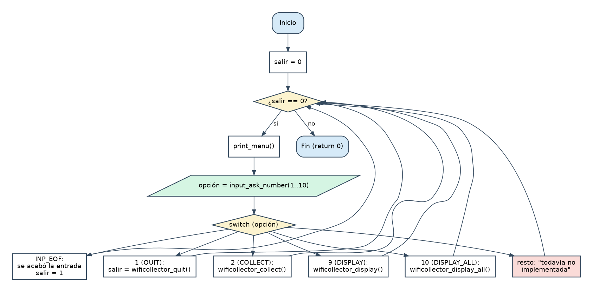

# Etapa 2 · El menú principal, el bucle y `quit` (y tu primer `Makefile`)

> **Objetivo:** que el programa arranque, muestre el menú, lea una opción y permita salir con confirmación. El resto de opciones dirá "todavía no implementada".
> **Dificultad:** media-baja. **Tiempo orientativo:** 1 sesión.

## 2.1 Teoría

### El bucle principal con una "bandera"

Un programa interactivo es: *mostrar menú → leer opción → ejecutarla → repetir* hasta que el usuario decida salir. Se escribe con un `while` controlado por una variable **bandera** (`exit_requested`):

```c
int exit_requested = 0;

while (!exit_requested)
{
	/* ... mostrar menú, leer opción, ejecutarla ... */
}
```

`!exit_requested` es "no `exit_requested`": en C, `0` es falso y cualquier otro valor es verdadero.

### `switch`: elegir entre muchas opciones

Es un `if / else if` encadenado más legible cuando comparas **una misma variable** con valores constantes:

```c
switch (option)
{
	case MNU_QUIT:
		exit_requested = wificollector_quit();
		break;
	default:
		printf("Esa operación todavía no está implementada.\n");
		break;
}
```

> **Trampa clásica:** si olvidas el `break`, la ejecución **"se cae" al siguiente `case`** y ejecuta también su código (*fall-through*). `default` recoge todo lo que no coincide con ningún `case`.

### `enum`: ponerle nombre a los números

En vez de escribir `case 2:` (¿qué es el 2?), un `enum` da nombres a una serie de enteros:

```c
typedef enum
{
	MNU_QUIT = 1,   /* vale 1 */
	MNU_COLLECT,    /* vale 2: continúa contando */
	MNU_SHOW_DATA_ONE_NETWORK  /* vale 3 ... */
} menu_option_t;
```

Por defecto el primero vale 0; aquí lo forzamos a 1 para que el valor coincida con el número que ve el usuario en pantalla. Según la guía de estilo, los enumerados llevan prefijo del módulo (`MNU_`) y el tipo termina en `_t`.

### Funciones `static` y módulos

`print_menu()` solo la usa `main.c`, así que se declara `static`: **solo es visible dentro de ese fichero**. Es la regla E7: *todo lo que no necesiten los demás módulos, `static`*. Lo público (lo que sí usa `main.c`) se declara en `wificollector.h`.

### `Makefile`: que `make` compile por ti

Ya tienes cuatro `.c`. Escribir `gcc` a mano cada vez es pesado y propenso a errores. `make` lee un fichero `Makefile` con **reglas**:

```make
objetivo: dependencias
<TAB>receta (el comando que lo construye)
```

- `make` ejecuta la **primera** regla por defecto. Por eso `main` debe ir la primera: así `make` a secas construye el programa.
- Solo rehace un objetivo si alguna dependencia es **más reciente** que él. Si cambias un solo `.c`, solo se recompila ese.
- ⚠️ **La receta debe empezar con un carácter TABULADOR**, no con espacios. El error `missing separator` casi siempre es esto.
- Variables: `CC = gcc` y `CFLAGS = -Wall -g` evitan repetir. `-g` incluye información para el depurador.
- `make clean` borra lo generado. Se marca `.PHONY` porque `clean` no es un fichero.

(Mira de nuevo el diagrama de la Etapa 0 sobre compilación por módulos.)

## 2.2 Diagrama de flujo



## 2.3 Ficha: lo que debes escribir

**`wificollector.h` / `wificollector.c`** (por ahora solo una función):

| Función | Descripción |
|---|---|
| `int wificollector_quit(void)` | Pregunta *"¿Está seguro de que desea salir del programa? [s/N]: "* con `input_ask_yes_no`. Si confirma, imprime una despedida y devuelve **1**; si no, devuelve **0** |

**`main.c`**:

- Un `enum menu_option_t` con las 10 operaciones del menú (el valor del primero debe ser 1).
- Una función `static void print_menu(void)` que imprime el menú **tal como aparece en el enunciado** (las 10 operaciones).
- `main()` con el bucle: imprime el menú, lee la opción con `input_ask_number("    Opción elegida: ", 1, 10)` y hace `switch`:
  - `INP_EOF` → avisar de que se acabó la entrada y salir (¡nunca bucle infinito!).
  - `MNU_QUIT` → `exit_requested = wificollector_quit();`
  - `default` → "Esa operación todavía no está implementada."

**`Makefile`** con el objetivo `main` (el programa), `test_input` (el de la etapa anterior), una regla por cada `.o` indicando de qué `.c` y `.h` depende, y `clean`.

## 2.4 Pistas

> **Pista 1.** `case INP_EOF:` es válido aunque `INP_EOF` sea `-1`: los `case` aceptan cualquier constante entera, incluidas las macros.

> **Pista 2.** Cada `.o` depende de su `.c` **y de los `.h` que incluye**. Si cambias un `.h` y no lo pones como dependencia, `make` no recompilará lo que lo usa y tendrás errores incomprensibles.

> **Pista 3.** Si `make` dice `missing separator`, tu receta empieza por espacios. Si dice `undefined reference to 'wificollector_quit'`, falta incluir `wificollector.o` en la línea de enlace.

## 2.5 Pruebas

Compila con `make` (cero advertencias) y ejecuta `./main`:

| Escribes en el menú | Debe ocurrir |
|---|---|
| `abc`, vacío, `0`, `11`, `3 4` | Error y vuelve a pedir la opción |
| `3` (u otra no implementada) | "todavía no implementada" y vuelve el menú |
| `1`, luego `n` | Vuelve al menú |
| `1`, luego `x` o vacío | Error en la pregunta y repite |
| `1`, luego `s` | Despedida y el programa termina |
| **Ctrl+D** en el menú | "Fin de la entrada" y termina |

## 2.6 Solución de referencia

<details>
<summary><strong>Ver mi solución: main.c, wificollector.h, wificollector.c y Makefile</strong></summary>

**`etapa_2/main.c`**

```c
#include <stdio.h>
#include "input.h"
#include "wificollector.h"

/* Número de operaciones que muestra el menú principal */
#define MNU_NUM_OPTIONS 10

/*
 * menu_option_t
 * Operaciones del menú principal. El valor de cada una coincide con el número
 * que se muestra en pantalla (por eso la primera vale 1 y no 0).
 */
typedef enum
{
	MNU_QUIT = 1,
	MNU_COLLECT,
	MNU_SHOW_DATA_ONE_NETWORK,
	MNU_SELECT_BEST,
	MNU_DELETE_NET,
	MNU_SORT,
	MNU_EXPORT,
	MNU_IMPORT,
	MNU_DISPLAY,
	MNU_DISPLAY_ALL
} menu_option_t;

/*
 * print_menu()
 * Muestra por pantalla el menú principal con todas las operaciones.
 */
static void print_menu(void)
{
	printf("\n[2026] SAUCEM S.L. Recolector de redes inalámbricas\n\n");
	printf("    [ 1] wificollector_quit\n");
	printf("    [ 2] wificollector_collect\n");
	printf("    [ 3] wificollector_show_data_one_network\n");
	printf("    [ 4] wificollector_select_best\n");
	printf("    [ 5] wificollector_delete_net\n");
	printf("    [ 6] wificollector_sort\n");
	printf("    [ 7] wificollector_export\n");
	printf("    [ 8] wificollector_import\n");
	printf("    [ 9] wificollector_display\n");
	printf("    [10] wificollector_display_all\n\n");
}

/*
 * main()
 * Muestra el menú una y otra vez y ejecuta la operación elegida hasta que el
 * usuario confirma que quiere salir (o se acaba la entrada de datos).
 */
int main(void)
{
	int option;
	int exit_requested = 0;

	while (!exit_requested)
	{
		print_menu();
		option = input_ask_number("    Opción elegida: ", 1, MNU_NUM_OPTIONS);

		switch (option)
		{
			case INP_EOF:
				printf("\nFin de la entrada de datos.\n");
				exit_requested = 1;
				break;
			case MNU_QUIT:
				exit_requested = wificollector_quit();
				break;
			default:
				printf("Esa operación todavía no está implementada.\n");
				break;
		}
	}

	return 0;
}
```

**`etapa_2/wificollector.h`**

```c
#ifndef _WIFICOLLECTOR_H_
#define _WIFICOLLECTOR_H_

/* Pregunta si se quiere salir. Devuelve 1 si el usuario confirma, 0 si no */
int wificollector_quit(void);

#endif /* _WIFICOLLECTOR_H_ */
```

**`etapa_2/wificollector.c`**

```c
#include <stdio.h>
#include "wificollector.h"
#include "input.h"

/*
 * wificollector_quit()
 * Pregunta al usuario si de verdad quiere salir del programa.
 * Devuelve 1 si el usuario confirma y 0 si decide seguir.
 */
int wificollector_quit(void)
{
	int answer;

	answer = input_ask_yes_no(
		"¿Está seguro de que desea salir del programa? [s/N]: ");

	if (answer == INP_YES)
	{
		printf("¡Hasta pronto!\n");
		return 1;
	}

	return 0;
}
```

**`etapa_2/Makefile`**

```makefile
# Makefile - Etapa 2: menú principal y wificollector_quit
# Compilar:  make        Ejecutar:  ./main        Limpiar:  make clean

CC = gcc
CFLAGS = -Wall -g

main: main.o input.o wificollector.o
	$(CC) $(CFLAGS) -o main main.o input.o wificollector.o

test_input: test_input.o input.o
	$(CC) $(CFLAGS) -o test_input test_input.o input.o

main.o: main.c input.h wificollector.h
	$(CC) $(CFLAGS) -c main.c

input.o: input.c input.h
	$(CC) $(CFLAGS) -c input.c

wificollector.o: wificollector.c wificollector.h input.h
	$(CC) $(CFLAGS) -c wificollector.c

test_input.o: test_input.c input.h
	$(CC) $(CFLAGS) -c test_input.c

clean:
	rm -f *.o main test_input

.PHONY: clean
```

</details>

**Fíjate en:** que `wificollector_quit` **no** termina el programa: solo devuelve "sí/no" y es `main` quien decide. Así cada función hace una sola cosa y es fácil de probar.

## 2.7 Recursos

- [`switch`](https://en.cppreference.com/w/c/language/switch) · [`enum`](https://en.cppreference.com/w/c/language/enum)
- [Manual de GNU Make](https://www.gnu.org/software/make/manual/make.html) (completo) y [Makefile Tutorial](https://makefiletutorial.com/) (corto y práctico)
- Beej's Guide to C: capítulos sobre `switch`, `enum` y *Multifile Projects*

## 2.8 Lista de comprobación

- [ ] `make` compila sin advertencias y `make clean` limpia
- [ ] Todas las filas de la tabla de pruebas funcionan
- [ ] Sé explicar qué pasa si quito un `break` de un `case`
- [ ] Sé explicar por qué `print_menu` es `static`
- [ ] He reescrito `main()` sin mirar
