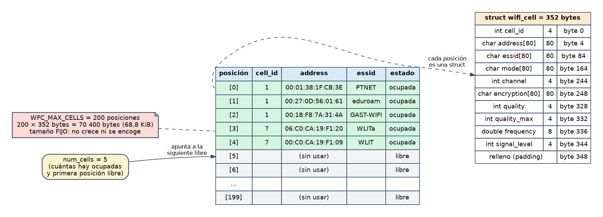

# Etapa 3 · La estructura `wifi_cell` y cómo mostrar una celda

> **Objetivo:** definir el tipo de dato que representa un punto de acceso y escribir la función que lo imprime con el formato del enunciado.
> **Dificultad:** baja-media. **Tiempo orientativo:** 1 sesión.

## 3.1 Teoría

### `struct`: agrupar datos relacionados

Un punto de acceso tiene 9 datos (número de celda, MAC, ESSID...). En vez de manejar 9 variables sueltas, una `struct` los agrupa en **un solo tipo nuevo**:

```c
struct wifi_cell
{
	int cell_id;
	char address[CEL_MAX_STR];
	/* ... más campos ... */
};
```

Esto solo **define el tipo** (como un molde). Para tener un dato real declaras una variable de ese tipo y accedes a sus campos con el punto:

```c
struct wifi_cell cell;     /* una variable de tipo struct wifi_cell */
cell.cell_id = 1;          /* acceso a un campo con '.' */
```

### Elegir el tipo de cada campo

| Dato | Ejemplo | Tipo | Por qué |
|---|---|---|---|
| Identificador de celda | `1` | `int` | Número natural |
| Dirección MAC | `00:01:38:1F:CB:3E` | `char[80]` | Texto (con `:`) |
| ESSID | `PTNET` | `char[80]` | Texto, sin las comillas del fichero |
| Modo | `Master` | `char[80]` | Texto (sencillo; un `enum` sería una mejora posterior) |
| Canal | `2` | `int` | Número natural |
| Cifrado | `on` / `off` | `char[80]` | Texto |
| Calidad `n1/n2` | `70/70` | `int` + `int` | **Dos** números: `quality` y `quality_max` |
| Frecuencia | `2.417` | `double` | Tiene decimales. `double` tiene más precisión que `float` |
| Nivel de señal | `-33` | `int` | Entero negativo (dBm) |

El enunciado exige cadenas de **80 caracteres máximo**, así que usamos una macro `CEL_MAX_STR` = 80 para todas (regla C1 de la guía: tamaños con macros, y prefijo `CEL_` por ser constante pública del módulo `cell`).

### Las cadenas no se asignan con `=`

```c
cell.essid = "PTNET";           /* ERROR: no se puede asignar a un array */
strcpy(cell.essid, "PTNET");    /* CORRECTO: copia carácter a carácter (<string.h>) */
```

`strcpy` **no comprueba** que quepa: si el origen es más largo que el destino, escribe fuera del array (desbordamiento). En la Etapa 4 evitaremos ese riesgo usando `sscanf` con límite de anchura.

### Copiar y pasar structs

- **Una `struct` se copia entera con `=`**, incluidos los arrays que lleva dentro: `cells[3] = cell;` copia 352 bytes. (Los arrays sueltos, en cambio, no se pueden copiar así.)
- Al pasar una `struct` a una función **se pasa una copia** (*paso por valor*): `void cell_print(struct wifi_cell cell)`. La función no puede modificar el original, y eso es justo lo que queremos al imprimir. Copiar 352 bytes es barato aquí; cuando veas punteros aprenderás a pasar solo la dirección.

### Un array de structs en memoria



Cada posición del array es una `struct wifi_cell` completa (352 bytes: la suma de los campos más algo de **relleno** para alinear el `double`). El array global de 200 ocupa unos **68,8 KiB** y su tamaño es **fijo**: eso es lo que cambiará en la Entrega 2. Fíjate también en que `num_cells` sirve a la vez de **contador** (cuántas hay) y de **índice de la primera posición libre**. Lo usaremos en la Etapa 5.

### `printf` con formato

| Formato | Para | Ejemplo en nuestro caso |
|---|---|---|
| `%d` | `int` | `cell.channel` |
| `%s` | cadena | `cell.essid` |
| `%f` | `double` (6 decimales) | `2.417` se imprime `2.417000` |
| `\"` | comilla doble dentro de una cadena | `"\"%s\""` imprime `"PTNET"` |

El enunciado muestra este formato de salida (y nuestro programa debe reproducirlo):

```
Cell 1: 00:01:38:1F:CB:3E "PTNET" Master 2 on 70/70 2.417000 -33
```

## 3.2 Ficha: lo que debes escribir

**`cell.h`**:

- Guarda `_CELL_H_`.
- La macro `CEL_MAX_STR` (80).
- La `struct wifi_cell` con los 9 datos (10 campos, porque la calidad son dos), **cada campo comentado**.
- El prototipo `void cell_print(struct wifi_cell cell);`

**`cell.c`**: la función `cell_print`, que imprime la celda en **una línea** con el formato de arriba.

**`test_cell_print.c`**: un `main` que rellena **a mano** una celda (con `strcpy` para las cadenas) con los datos de la celda 1 del enunciado y la imprime.

Para compilar a mano: `gcc -Wall -o test_cell_print test_cell_print.c cell.c`

## 3.3 Pruebas

La salida de `test_cell_print` debe ser **exactamente**:

```
Cell 1: 00:01:38:1F:CB:3E "PTNET" Master 2 on 70/70 2.417000 -33
```

Cambia valores (otro canal, otro nivel de señal, una frecuencia de `5.2`) y comprueba que el formato sigue siendo correcto.

## 3.4 Errores típicos

- `%d` con un `double` (o `%f` con un `int`): `-Wall` avisa con `format '%d' expects argument of type 'int'`. **Léelo**: te dice exactamente cuál es el error.
- Olvidar `#include <string.h>` en el test (por usar `strcpy`).
- Poner el `;` tras la `}` de la `struct` en el `.h` (es obligatorio: `};`).
- Declarar `cell_print` en el `.h` con un tipo y definirla en el `.c` con otro: por eso la regla E3 manda incluir el propio `.h` en el `.c`: así el compilador detecta la discrepancia.

## 3.5 Solución de referencia

<details>
<summary><strong>Ver mi solución: cell.h, cell.c y test_cell_print.c</strong></summary>

**`etapa_3/cell.h`**

```c
#ifndef _CELL_H_
#define _CELL_H_

/* Tamaño máximo de las cadenas de texto de una celda (incluye el '\0') */
#define CEL_MAX_STR 80

/*
 * struct wifi_cell
 * Datos de un punto de acceso: un bloque de un fichero info_cell_N.txt.
 */
struct wifi_cell
{
	int cell_id;                 /* Identificador de celda (la N de "Cell N") */
	char address[CEL_MAX_STR];   /* Dirección MAC, p. ej. 00:01:38:1F:CB:3E */
	char essid[CEL_MAX_STR];     /* Nombre de la red, sin las comillas */
	char mode[CEL_MAX_STR];      /* Modo: Master, Ad-Hoc, Managed... */
	int channel;                 /* Canal */
	char encryption[CEL_MAX_STR];/* Cifrado: "on" u "off" */
	int quality;                 /* Calidad actual (el n1 de n1/n2) */
	int quality_max;             /* Calidad máxima (el n2 de n1/n2) */
	double frequency;            /* Frecuencia en GHz */
	int signal_level;            /* Nivel de señal en dBm */
};

/* Imprime una celda en una línea: Cell 1: <MAC> "<ESSID>" <modo> ... */
void cell_print(struct wifi_cell cell);

#endif /* _CELL_H_ */
```

**`etapa_3/cell.c`**

```c
#include <stdio.h>
#include "cell.h"

/*
 * cell_print()
 * Imprime una celda en una sola línea. Ejemplo de salida:
 * Cell 1: 00:01:38:1F:CB:3E "PTNET" Master 2 on 70/70 2.417000 -33
 */
void cell_print(struct wifi_cell cell)
{
	printf("Cell %d: %s \"%s\" %s %d %s %d/%d %f %d\n",
		cell.cell_id, cell.address, cell.essid, cell.mode, cell.channel,
		cell.encryption, cell.quality, cell.quality_max, cell.frequency,
		cell.signal_level);
}
```

**`etapa_3/test_cell_print.c`**

```c
#include <stdio.h>
#include <string.h>
#include "cell.h"

/*
 * main()
 * Programa de prueba de cell_print(): rellena una celda a mano y la imprime.
 * Debe imprimir exactamente:
 * Cell 1: 00:01:38:1F:CB:3E "PTNET" Master 2 on 70/70 2.417000 -33
 */
int main(void)
{
	struct wifi_cell cell;

	cell.cell_id = 1;
	strcpy(cell.address, "00:01:38:1F:CB:3E");
	strcpy(cell.essid, "PTNET");
	strcpy(cell.mode, "Master");
	cell.channel = 2;
	strcpy(cell.encryption, "on");
	cell.quality = 70;
	cell.quality_max = 70;
	cell.frequency = 2.417;
	cell.signal_level = -33;

	cell_print(cell);

	return 0;
}
```

</details>

## 3.6 Recursos

- [`struct`](https://en.cppreference.com/w/c/language/struct) · [`strcpy`](https://en.cppreference.com/w/c/string/byte/strcpy) · [`printf` y sus formatos](https://en.cppreference.com/w/c/io/fprintf)
- Beej's Guide to C: capítulo *Structs*
- `man 3 printf`

## 3.7 Lista de comprobación

- [ ] La salida es idéntica a la del enunciado, incluidos `2.417000` y las comillas del ESSID
- [ ] Todos los campos de la `struct` están comentados
- [ ] Sé explicar por qué `strcpy` es peligroso y por qué `cell.essid = "x"` no compila
- [ ] Sé qué significa "paso por valor"
- [ ] He reescrito `cell_print` sin mirar
