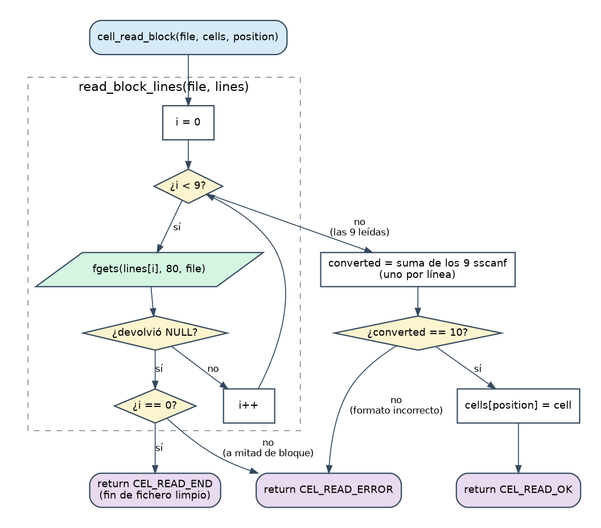

# Etapa 4 · Leer un bloque de un fichero de texto

> **Objetivo:** convertir las 9 líneas de un bloque de `info_cell_N.txt` en una `struct wifi_cell`, detectando ficheros vacíos, truncados o con formato incorrecto.
> **Dificultad:** **la más alta de la Fase 1.** Tómate el tiempo. **Tiempo orientativo:** 2 sesiones.

## 4.1 Teoría

### Ficheros de texto en C

```c
FILE *file;                      /* "manillar" del fichero abierto */
file = fopen("info_cell_1.txt", "r");   /* "r" = leer */
if (file == NULL)                /* ¡SIEMPRE comprobar! */
{
	/* no existe, sin permisos, etc. */
}
/* ... leer con fgets(buffer, size, file) ... */
fclose(file);                    /* cerrar siempre que se abrió */
```

- `fopen` devuelve `NULL` si falla. **Si no lo compruebas y sigues, tu programa se cae.** El enunciado pide expresamente robustez ante "un nombre de fichero incorrecto".
- `fgets` funciona igual que con el teclado, pero leyendo de `file` en vez de `stdin`: devuelve `NULL` cuando no quedan más líneas.
- Cada `fopen` exitoso debe tener su `fclose`.

### Estrategia: leer las 9 líneas, y después analizarlas

Un bloque son siempre 9 líneas en el mismo orden. Dividimos el trabajo en dos pasos:

1. **Leer** las 9 líneas con `fgets` y guardarlas en un array de 9 cadenas.
2. **Analizar** cada línea con un `sscanf` que sabe *cómo es esa línea*.



Un array de 9 cadenas de 80 caracteres es un **array de dos dimensiones**:

```c
char lines[9][80];     /* lines[0] es la línea 1 ... lines[8] la novena */
```

Al pasarlo a una función, solo puede omitirse la **primera** dimensión: `char lines[][CEL_MAX_STR]`.

### Los `sscanf` de este proyecto, uno por línea

En el formato de `sscanf`, el texto literal **debe coincidir exactamente** con la línea, y cada `%` extrae un dato:

| Línea del fichero | Campo(s) | Formato de `sscanf` | Datos |
|---|---|---|:--:|
| `Cell 1` | `cell_id` | `"Cell %d"` | 1 |
| `Address: 00:01:38:1F:CB:3E` | `address` | `"Address: %79s"` | 1 |
| `ESSID:"PTNET"` | `essid` | `"ESSID:\"%79[^\"]\""` | 1 |
| `Mode:Master` | `mode` | `"Mode:%79s"` | 1 |
| `Channel:2` | `channel` | `"Channel:%d"` | 1 |
| `Encryption key:on` | `encryption` | `"Encryption key:%79s"` | 1 |
| `Quality=70/70` | `quality`, `quality_max` | `"Quality=%d/%d"` | **2** |
| `Frequency:2.417 GHz` | `frequency` | `"Frequency:%lf"` | 1 |
| `Signal level=-33 dBm` | `signal_level` | `"Signal level=%d"` | 1 |
| | | **Total esperado** | **10** |

Tres detalles importantes:

1. **`%79s` y no `%s`.** El número es la **anchura máxima**: `sscanf` copiará como mucho 79 caracteres y añadirá el `'\0'`, así que **nunca desborda** un `char[80]`. Siempre `tamaño - 1`.
2. **`%[^"]` (un *scanset*)** significa "lee todos los caracteres hasta encontrar una comilla". Es necesario porque `%s` se detiene en el **primer espacio**, y hay ESSID como `"Miguel 3"`. Fíjate cómo las comillas literales del formato (escritas `\"`) delimitan el nombre.
3. **`%lf` para leer un `double`** con `sscanf` (`l` de *long*). En `printf`, en cambio, se usa `%f` para `double`.

### Comprobar que todo salió bien: sumar lo que devuelve `sscanf`

Cada `sscanf` devuelve cuántos datos convirtió. Si **la suma de los nueve es 10**, todo el bloque era correcto. Si una línea tiene la palabra clave equivocada (`Canal:` en vez de `Channel:`) o falta un dato, esa llamada devuelve menos (0 o -1) y la suma no llega a 10.

### Devolver un estado con un `enum`

La función puede terminar de tres formas distintas, y al que la llama le interesa saber cuál:

```c
typedef enum
{
	CEL_READ_OK,     /* se leyó un bloque completo y correcto */
	CEL_READ_END,    /* no quedan bloques: fin del fichero (normal) */
	CEL_READ_ERROR   /* bloque incompleto o con formato erróneo */
} cell_read_status_t;
```

Distinguir `END` de `ERROR` es lo que permite decir "fichero vacío" o "fichero truncado" en vez de un genérico "algo falló".

### Rellenar primero una variable local

`cell_read_block` analiza los datos en una `struct wifi_cell` **local** y **solo si todo es correcto** la copia al array con `cells[position] = cell;`. Así, un bloque a medias nunca deja "basura" en el array global.

### Qué pasa si no limitas la anchura (desbordamiento de buffer)

Si el ESSID de un fichero tuviera 200 caracteres y usaras `%s`, `sscanf` escribiría 200 bytes en un array de 80, **pisando otras variables en memoria**. Es el fallo de seguridad más típico de C. Con `%79s`, el mismo fichero haría que el campo se rellene con los 79 primeros caracteres y el programa siga siendo seguro.

## 4.2 Ficha: lo que debes escribir

Amplía `cell.h` y `cell.c`:

**En `cell.h`**: `#include <stdio.h>` (por el tipo `FILE`), el `enum cell_read_status_t` y el prototipo:

```c
cell_read_status_t cell_read_block(FILE *file, struct wifi_cell cells[],
	int position);
```

**En `cell.c`**:

| Elemento | Descripción |
|---|---|
| Macros privadas | `CEL_LINES_PER_BLOCK` (9) y `CEL_FIELDS_PER_BLOCK` (10) |
| `static cell_read_status_t read_block_lines(FILE *file, char lines[][CEL_MAX_STR])` | Lee las 9 líneas con `fgets`. Devuelve `CEL_READ_END` si el fichero se acaba **antes de la primera línea**, `CEL_READ_ERROR` si se acaba **a mitad de bloque** y `CEL_READ_OK` si las leyó todas |
| `cell_read_status_t cell_read_block(...)` | Lee las líneas, hace los 9 `sscanf`, comprueba que suman 10 y, si es así, guarda la celda en `cells[position]`. **No** comprueba que `position` sea válida: es responsabilidad de quien llama |

**`test_cell_read.c`**: abre `info_cell_1.txt`, llama a `cell_read_block` en un bucle hasta que no devuelva `CEL_READ_OK`, imprime cada celda y al final dice cuántos bloques leyó (debe ser 3).

Compilar: `gcc -Wall -o test_cell_read test_cell_read.c cell.c` (con los ficheros de datos en la misma carpeta).

## 4.3 Pistas

> **Pista 1.** Estructura de `cell_read_block`: (1) `status = read_block_lines(...)`; si no es `OK`, `return status;`. (2) Los nueve `sscanf`, el primero con `converted = ...` y los demás con `converted += ...`. (3) `if (converted != CEL_FIELDS_PER_BLOCK) return CEL_READ_ERROR;`. (4) copiar y `return CEL_READ_OK;`.

> **Pista 2.** Para los campos de texto, pasa el nombre del array **sin `&`** (`cell.address`); para los números, **con `&`** (`&cell.channel`). Un array ya "es" una dirección; un `int` no.

> **Pista 3.** En `read_block_lines`, si `fgets` falla en la vuelta `i == 0`, el fichero acabó limpiamente; si falla en cualquier otra, el bloque estaba incompleto.

## 4.4 Pruebas

1. Ejecuta `test_cell_read`: debe imprimir las 3 celdas del fichero 1 y `Bloques leídos: 3`.
2. **Ahora rómpelo tú** (copia el fichero y modifícalo, sin tocar los originales):

| Modificación | Resultado esperado |
|---|---|
| Fichero vacío | 0 bloques, sin error |
| Borrar las últimas 3 líneas del fichero | Lee los bloques completos y luego `CEL_READ_ERROR` |
| Cambiar `Channel:` por `Canal:` en un bloque | `CEL_READ_ERROR` en ese bloque |
| Nombre de fichero inexistente | El test avisa de que no se pudo abrir (`fopen` devolvió `NULL`) |
| Un ESSID con espacio (`info_cell_6.txt`: `"Miguel 3"`) | Se lee entero, con el espacio |

Comprobar que tu código **se comporta bien ante datos malos** es, precisamente, lo que significa ser robusto.

## 4.5 Errores típicos

- Olvidar el `&` en `sscanf` para los `int`/`double` → comportamiento indefinido (`-Wall` suele avisar).
- Usar `%s` para el ESSID: se corta en `"Miguel`.
- Escribir `%79s` pero declarar el array de 50: el límite debe ser **tamaño − 1**.
- Usar `%f` en vez de `%lf` en `sscanf` para un `double`: guarda basura sin avisar.
- Dejar el fichero abierto al hacer `return` anticipado (fuga de recursos).

## 4.6 Retos opcionales (para practicar sin ayuda)

- **Reto A:** haz que el análisis no dependa del **orden** de las líneas: mira el principio de cada línea con `strncmp` y decide qué `sscanf` aplicar.
- **Reto B:** valida que la MAC tiene el formato `XX:XX:XX:XX:XX:XX`.
- **Reto C:** convierte `mode` en un `enum` (`Auto`, `Ad-Hoc`, `Managed`, `Master`, `Repeater`, `Secondary`, `Monitor`, `Unknown`).

## 4.7 Solución de referencia

<details>
<summary><strong>Ver mi solución: cell.h, cell.c y test_cell_read.c</strong></summary>

**`etapa_4/cell.h`**

```c
#ifndef _CELL_H_
#define _CELL_H_

#include <stdio.h>

/* Tamaño máximo de las cadenas de texto de una celda (incluye el '\0') */
#define CEL_MAX_STR 80

/*
 * struct wifi_cell
 * Datos de un punto de acceso: un bloque de un fichero info_cell_N.txt.
 */
struct wifi_cell
{
	int cell_id;                 /* Identificador de celda (la N de "Cell N") */
	char address[CEL_MAX_STR];   /* Dirección MAC, p. ej. 00:01:38:1F:CB:3E */
	char essid[CEL_MAX_STR];     /* Nombre de la red, sin las comillas */
	char mode[CEL_MAX_STR];      /* Modo: Master, Ad-Hoc, Managed... */
	int channel;                 /* Canal */
	char encryption[CEL_MAX_STR];/* Cifrado: "on" u "off" */
	int quality;                 /* Calidad actual (el n1 de n1/n2) */
	int quality_max;             /* Calidad máxima (el n2 de n1/n2) */
	double frequency;            /* Frecuencia en GHz */
	int signal_level;            /* Nivel de señal en dBm */
};

/*
 * cell_read_status_t
 * Resultado de intentar leer un bloque de un fichero.
 */
typedef enum
{
	CEL_READ_OK,    /* Se leyó un bloque completo y correcto */
	CEL_READ_END,   /* No quedan más bloques: fin del fichero */
	CEL_READ_ERROR  /* El bloque está incompleto o tiene mal formato */
} cell_read_status_t;

/* Imprime una celda en una línea: Cell 1: <MAC> "<ESSID>" <modo> ... */
void cell_print(struct wifi_cell cell);

/* Lee el siguiente bloque del fichero y lo guarda en cells[position] */
cell_read_status_t cell_read_block(FILE *file, struct wifi_cell cells[],
	int position);

#endif /* _CELL_H_ */
```

**`etapa_4/cell.c`**

```c
#include <stdio.h>
#include "cell.h"

/* Número de líneas de texto que ocupa un bloque en un fichero info_cell */
#define CEL_LINES_PER_BLOCK 9

/* Datos que sscanf debe convertir en total por bloque ("n1/n2" cuenta 2) */
#define CEL_FIELDS_PER_BLOCK 10

/*
 * cell_print()
 * Imprime una celda en una sola línea. Ejemplo de salida:
 * Cell 1: 00:01:38:1F:CB:3E "PTNET" Master 2 on 70/70 2.417000 -33
 */
void cell_print(struct wifi_cell cell)
{
	printf("Cell %d: %s \"%s\" %s %d %s %d/%d %f %d\n",
		cell.cell_id, cell.address, cell.essid, cell.mode, cell.channel,
		cell.encryption, cell.quality, cell.quality_max, cell.frequency,
		cell.signal_level);
}

/*
 * read_block_lines()
 * Lee del fichero las 9 líneas de un bloque y las guarda en "lines".
 * Devuelve CEL_READ_OK si las leyó todas, CEL_READ_END si el fichero ya
 * estaba acabado antes de la primera línea y CEL_READ_ERROR si se acaba a
 * mitad de un bloque.
 */
static cell_read_status_t read_block_lines(FILE *file,
	char lines[][CEL_MAX_STR])
{
	int i;

	for (i = 0; i < CEL_LINES_PER_BLOCK; i++)
	{
		if (fgets(lines[i], CEL_MAX_STR, file) == NULL)
		{
			if (i == 0)
			{
				return CEL_READ_END;
			}
			return CEL_READ_ERROR;
		}
	}

	return CEL_READ_OK;
}

/*
 * cell_read_block()
 * Lee el siguiente bloque de 9 líneas del fichero ya abierto "file" y, si es
 * correcto, lo guarda en cells[position]. El que llama debe asegurarse de que
 * "position" es una posición válida del array.
 * Devuelve CEL_READ_OK, CEL_READ_END (no quedan bloques) o CEL_READ_ERROR.
 */
cell_read_status_t cell_read_block(FILE *file, struct wifi_cell cells[],
	int position)
{
	char lines[CEL_LINES_PER_BLOCK][CEL_MAX_STR];
	struct wifi_cell cell;
	cell_read_status_t status;
	int converted;

	status = read_block_lines(file, lines);
	if (status != CEL_READ_OK)
	{
		return status;
	}

	/* Cada sscanf devuelve cuántos datos pudo convertir de su línea */
	converted = sscanf(lines[0], "Cell %d", &cell.cell_id);
	converted += sscanf(lines[1], "Address: %79s", cell.address);
	converted += sscanf(lines[2], "ESSID:\"%79[^\"]\"", cell.essid);
	converted += sscanf(lines[3], "Mode:%79s", cell.mode);
	converted += sscanf(lines[4], "Channel:%d", &cell.channel);
	converted += sscanf(lines[5], "Encryption key:%79s", cell.encryption);
	converted += sscanf(lines[6], "Quality=%d/%d", &cell.quality,
		&cell.quality_max);
	converted += sscanf(lines[7], "Frequency:%lf", &cell.frequency);
	converted += sscanf(lines[8], "Signal level=%d", &cell.signal_level);

	if (converted != CEL_FIELDS_PER_BLOCK)
	{
		return CEL_READ_ERROR;
	}

	cells[position] = cell;
	return CEL_READ_OK;
}
```

**`etapa_4/test_cell_read.c`**

```c
#include <stdio.h>
#include "cell.h"

/* Capacidad del array de prueba */
#define TST_MAX_CELLS 10

/*
 * main()
 * Programa de prueba de cell_read_block(): lee todos los bloques del fichero
 * info_cell_1.txt, los imprime y cuenta cuántos hay.
 */
int main(void)
{
	struct wifi_cell cells[TST_MAX_CELLS];
	cell_read_status_t status;
	FILE *file;
	int count = 0;

	file = fopen("info_cell_1.txt", "r");
	if (file == NULL)
	{
		printf("Error: no se pudo abrir info_cell_1.txt\n");
		return 1;
	}

	status = CEL_READ_OK;
	while (status == CEL_READ_OK && count < TST_MAX_CELLS)
	{
		status = cell_read_block(file, cells, count);
		if (status == CEL_READ_OK)
		{
			cell_print(cells[count]);
			count++;
		}
	}

	if (status == CEL_READ_ERROR)
	{
		printf("Error: formato incorrecto en el fichero\n");
	}
	printf("Bloques leídos: %d\n", count);

	fclose(file);
	return 0;
}
```

</details>

**Fíjate en:** el mensaje del comentario de cada `sscanf`, el reparto en dos funciones para que ninguna sea larga (regla B4) y que `read_block_lines` es `static` (solo la usa este fichero).

## 4.8 Recursos

- [`fopen`](https://en.cppreference.com/w/c/io/fopen) · [`fgets`](https://en.cppreference.com/w/c/io/fgets) · [`sscanf` y sus formatos (anchura, `%[...]`)](https://en.cppreference.com/w/c/io/fscanf)
- Beej's Guide to C: capítulos *File Input/Output* y *Multidimensional Arrays*
- Buscar: "buffer overflow C scanf %s width" para entender por qué el límite de anchura importa.
- `man 3 fopen`, `man 3 sscanf`

## 4.9 Lista de comprobación

- [ ] `test_cell_read` lee 3 bloques del fichero 1
- [ ] Los casos "rotos" de la tabla dan el resultado esperado
- [ ] Sé explicar `%79s`, `%[^"]` y por qué se suma hasta 10
- [ ] Sé explicar por qué se rellena una variable local y no directamente el array
- [ ] He reescrito `cell_read_block` **sin mirar**
