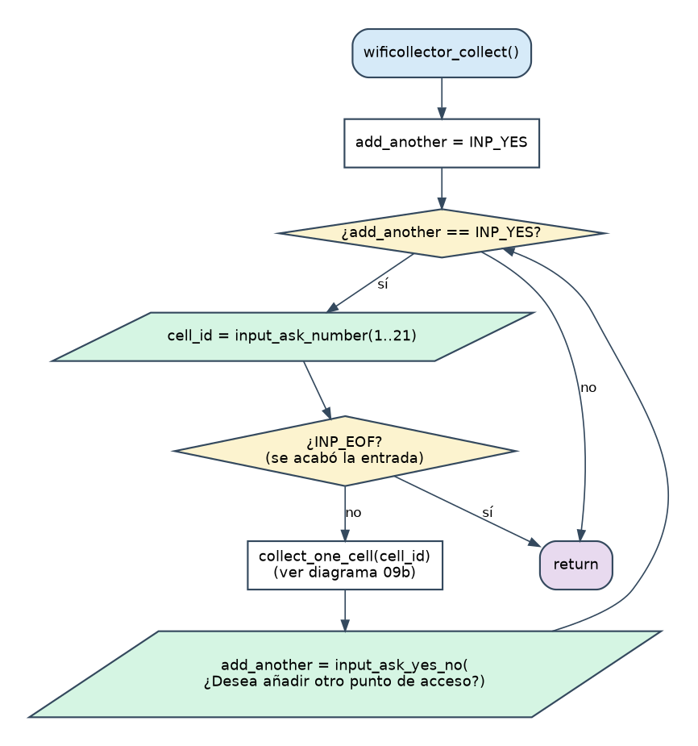
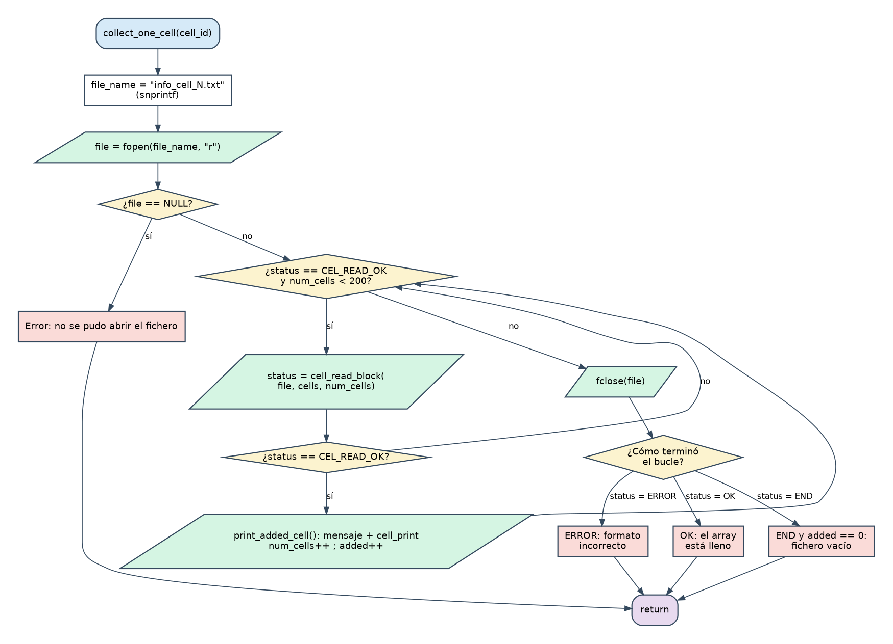

# Etapa 5 · `wificollector_collect`: llenar el array

> **Objetivo:** que la opción 2 del menú pida una celda, lea su fichero, añada sus puntos de acceso a un array de 200 posiciones y pregunte si se quiere añadir otra.
> **Dificultad:** media (ya tienes casi todas las piezas). **Tiempo orientativo:** 1-2 sesiones.

## 5.1 Teoría

### Estado dentro de un módulo: variables globales `static`

El array y su contador tienen que **sobrevivir** entre una opción del menú y la siguiente (recolectas hoy, muestras después). Eso se consigue con variables **globales**, declaradas fuera de cualquier función. Reglas de la guía de estilo (E7):

- Las globales privadas son `static`: solo se ven desde este `.c`. Nadie de fuera puede modificarlas por error; todo acceso pasa por tus funciones.
- Se declaran **juntas, al principio del fichero**, nunca desperdigadas.
- Se documentan.

```c
/* Array con los puntos de acceso recolectados hasta el momento */
static struct wifi_cell cells[WFC_MAX_CELLS];

/* Número de posiciones del array que están ocupadas */
static int num_cells = 0;
```

### La regla que no se puede romper: los límites del array

Un array de 200 elementos tiene posiciones válidas **0 a 199**. C **no comprueba** los límites: escribir en `cells[200]` no da error; escribe en la memoria de al lado y estropea otra cosa (*comportamiento indefinido*), y el fallo puede aparecer mucho después y en otro sitio. **Eres tú quien debe comprobarlo antes de escribir:**

```c
while (status == CEL_READ_OK && num_cells < WFC_MAX_CELLS)
```

`num_cells` cumple siempre dos papeles a la vez (mira el diagrama de memoria de la Etapa 3):

- **Cuántas** posiciones hay ocupadas.
- El **índice de la primera libre** (si hay 5 ocupadas, son la 0-4 y la siguiente libre es la 5).

Por eso se escribe en `cells[num_cells]` y *después* se hace `num_cells++`.

### No confundir dos números

| Nombre | Qué es | Rango |
|---|---|---|
| `cell_id` | El **número de celda** que escribe el usuario; el `N` de `info_cell_N.txt` y el campo `cell_id` de cada punto de acceso | 1-21 |
| posición (`position`, `num_cells`) | Un **índice del array** | 0-199 |

Una celda (`cell_id`) tiene varios puntos de acceso, cada uno en una posición distinta del array.

### `snprintf`: construir un nombre de fichero

```c
char file_name[WFC_MAX_FILE_NAME];
snprintf(file_name, WFC_MAX_FILE_NAME, "info_cell_%d.txt", cell_id);
```

Es `printf`, pero **escribe en una cadena** en vez de en pantalla, y el segundo parámetro es el tamaño máximo, así que **nunca desborda**. (`sprintf`, sin tamaño, sí puede: evítalo.)

### Descomponer en funciones pequeñas

Tres funciones, cada una con una única responsabilidad (regla B4: que quepan en pantalla):

| Función | Visibilidad | Responsabilidad |
|---|---|---|
| `wificollector_collect` | pública | El bucle "¿qué celda? → leer → ¿otra?" |
| `collect_one_cell` | `static` | Abrir **un** fichero y añadir todos sus bloques |
| `print_added_cell` | `static` | Imprimir el mensaje de "añadido" y la celda |

### El bucle de lectura y por qué hay que cerrar el fichero

El bucle de `collect_one_cell` termina por tres motivos distintos (se acabó el fichero, bloque defectuoso, array lleno). Después de él **siempre** se hace `fclose(file)` y luego se decide qué mensaje dar mirando cómo terminó (`status`). Esto es más limpio que ir cerrando el fichero en cada rama de error.

### Cadenas largas partidas en varias líneas

C pega automáticamente los literales de texto adyacentes, así que puedes cumplir la regla de las 80 columnas sin perder nada:

```c
printf("Aviso: el array está lleno (%d posiciones). No se añaden "
	"más datos.\n\n", WFC_MAX_CELLS);
```

## 5.2 Diagramas de flujo





## 5.3 Ficha: lo que debes escribir

**`wificollector.h`**: añade `void wificollector_collect(void);`

**`wificollector.c`**:

| Elemento | Descripción |
|---|---|
| Macros privadas | `WFC_MIN_CELL_ID` (1), `WFC_MAX_CELL_ID` (21), `WFC_MAX_CELLS` (200), `WFC_MAX_FILE_NAME` (80) |
| Globales `static` | `cells[WFC_MAX_CELLS]` y `num_cells` (a 0) |
| `static void print_added_cell(const char file_name[], int position)` | Imprime `Datos leídos de info_cell_N.txt (añadidos a la posición P del array)`, la celda con `cell_print` y una línea en blanco |
| `static void collect_one_cell(int cell_id)` | Construye el nombre, abre el fichero (si falla: error y `return`), lee bloques mientras sean correctos **y** quepan, cierra, y avisa si hubo formato incorrecto, array lleno o fichero vacío |
| `void wificollector_collect(void)` | Bucle: pide celda con `input_ask_number("¿Qué celda quiere recolectar? (1 - 21): ", 1, 21)` (si `INP_EOF`, `return`), llama a `collect_one_cell`, y pregunta `"¿Desea añadir otro punto de acceso? [s/N]: "` |

**`main.c`**: añade `case MNU_COLLECT: wificollector_collect(); break;`

**`Makefile`**: ahora `wificollector.o` depende también de `cell.h`, y `main` necesita enlazar `cell.o`.

## 5.4 Pistas

> **Pista 1.** Empieza por `collect_one_cell`. Pruébala de forma provisional llamándola desde `main` con un número fijo, antes de escribir el bucle de preguntas.

> **Pista 2.** El mensaje de "array lleno" se imprime cuando el bucle termina con `status == CEL_READ_OK`: es la única forma de salir del bucle *sin* haber llegado al final ni a un error. Ponle un comentario, porque no es obvio.

> **Pista 3.** Si tras `make` ves `undefined reference to 'cell_print'`, te falta `cell.o` en la línea de enlace de `main`.

## 5.5 Pruebas

Reproduce primero **el ejemplo del enunciado** (mensaje "Fase I"):

```
printf '2\n1\ns\n7\nn\n10\n1\ns\n' | ./main
```

Debes ver las celdas de `info_cell_1.txt` en las posiciones **0, 1 y 2**, y las de `info_cell_7.txt` en la **3 y 4**, con el formato idéntico al del enunciado. Después:

| Prueba | Resultado esperado |
|---|---|
| Celda `abc`, vacío, `0`, `22` | Error y repregunta |
| Responder `x` a "¿otro punto de acceso?" | Error y repregunta |
| Renombrar temporalmente `info_cell_5.txt` y pedir la celda 5 | Mensaje de error y **el programa sigue** |
| Fichero vacío / truncado / con palabra clave cambiada (copias de prueba) | El mensaje correspondiente, sin caerse |
| Llenar el array (ver abajo) | Se añade hasta la posición **199** y luego "array lleno" |

Para llenar el array sin teclear 200 veces:

```
( printf '2\n'; for i in $(seq 1 69); do printf '1\ns\n'; done; printf '1\nn\n1\ns\n' ) | ./main | grep -E "Aviso|posición 19[89] "
```

(Opción 2; 69 veces "celda 1, sí"; otra vez "celda 1, no"; salir.) Esto añade 70 × 3 = 210 bloques en total: tiene que parar en la posición 199 y avisar.

## 5.6 Errores típicos

- Incrementar `num_cells` **antes** de imprimir/usar la posición: te desplazas una posición.
- Comprobar `num_cells <= WFC_MAX_CELLS` (con `<=`): permite escribir en la posición 200. Es el clásico *off-by-one*.
- No cerrar el fichero cuando falla algo a mitad.
- Reservar el nombre del fichero con muy poco espacio y usar `sprintf`.

## 5.7 Solución de referencia

<details>
<summary><strong>Ver mi solución: wificollector.h, wificollector.c, main.c y Makefile</strong></summary>

**`etapa_5/wificollector.h`**

```c
#ifndef _WIFICOLLECTOR_H_
#define _WIFICOLLECTOR_H_

/* Pregunta si se quiere salir. Devuelve 1 si el usuario confirma, 0 si no */
int wificollector_quit(void);

/* Lee los puntos de acceso de ficheros info_cell_N.txt y los guarda */
void wificollector_collect(void);

#endif /* _WIFICOLLECTOR_H_ */
```

**`etapa_5/wificollector.c`**

```c
#include <stdio.h>
#include "wificollector.h"
#include "cell.h"
#include "input.h"

/* Número de celda mínimo: corresponde al fichero info_cell_1.txt */
#define WFC_MIN_CELL_ID 1

/* Número de celda máximo: corresponde al fichero info_cell_21.txt */
#define WFC_MAX_CELL_ID 21

/* Número máximo de puntos de acceso que caben en el array */
#define WFC_MAX_CELLS 200

/* Tamaño máximo del nombre de un fichero (incluye el '\0' final) */
#define WFC_MAX_FILE_NAME 80

/* Variables globales (solo visibles dentro de este fichero) */

/* Array con los puntos de acceso recolectados hasta el momento */
static struct wifi_cell cells[WFC_MAX_CELLS];

/* Número de posiciones del array que están ocupadas */
static int num_cells = 0;

/*
 * wificollector_quit()
 * Pregunta al usuario si de verdad quiere salir del programa.
 * Devuelve 1 si el usuario confirma y 0 si decide seguir.
 */
int wificollector_quit(void)
{
	int answer;

	answer = input_ask_yes_no(
		"¿Está seguro de que desea salir del programa? [s/N]: ");

	if (answer == INP_YES)
	{
		printf("¡Hasta pronto!\n");
		return 1;
	}

	return 0;
}

/*
 * print_added_cell()
 * Confirma que se ha añadido un punto de acceso al array y lo imprime.
 */
static void print_added_cell(const char file_name[], int position)
{
	printf("Datos leídos de %s (añadidos a la posición %d del array)\n",
		file_name, position);
	cell_print(cells[position]);
	printf("\n");
}

/*
 * collect_one_cell()
 * Abre el fichero info_cell_N.txt y añade al array todos los puntos de acceso
 * que contiene, hasta que se acabe el fichero o se llene el array.
 */
static void collect_one_cell(int cell_id)
{
	char file_name[WFC_MAX_FILE_NAME];
	cell_read_status_t status = CEL_READ_OK;
	FILE *file;
	int added = 0;

	snprintf(file_name, WFC_MAX_FILE_NAME, "info_cell_%d.txt", cell_id);
	file = fopen(file_name, "r");
	if (file == NULL)
	{
		printf("Error: no se pudo abrir el fichero %s\n\n", file_name);
		return;
	}

	while (status == CEL_READ_OK && num_cells < WFC_MAX_CELLS)
	{
		status = cell_read_block(file, cells, num_cells);
		if (status == CEL_READ_OK)
		{
			print_added_cell(file_name, num_cells);
			num_cells++;
			added++;
		}
	}
	fclose(file);

	if (status == CEL_READ_ERROR)
	{
		printf("Error: formato incorrecto en %s (se ignora el resto)\n\n",
			file_name);
	}
	else if (status == CEL_READ_OK)
	{
		/* El bucle terminó con un bloque correcto: el array está lleno */
		printf("Aviso: el array está lleno (%d posiciones). No se añaden "
			"más datos.\n\n", WFC_MAX_CELLS);
	}
	else if (added == 0)
	{
		printf("El fichero %s no contiene datos\n\n", file_name);
	}
}

/*
 * wificollector_collect()
 * Pide un número de celda, añade al array los datos de su fichero y pregunta
 * si se quiere añadir otra celda. Repite mientras el usuario responda "s".
 */
void wificollector_collect(void)
{
	int cell_id;
	int add_another = INP_YES;

	while (add_another == INP_YES)
	{
		cell_id = input_ask_number("¿Qué celda quiere recolectar? (1 - 21): ",
			WFC_MIN_CELL_ID, WFC_MAX_CELL_ID);
		if (cell_id == INP_EOF)
		{
			return;
		}

		collect_one_cell(cell_id);

		add_another = input_ask_yes_no(
			"¿Desea añadir otro punto de acceso? [s/N]: ");
	}
}
```

**`etapa_5/main.c`**

```c
#include <stdio.h>
#include "input.h"
#include "wificollector.h"

/* Número de operaciones que muestra el menú principal */
#define MNU_NUM_OPTIONS 10

/*
 * menu_option_t
 * Operaciones del menú principal. El valor de cada una coincide con el número
 * que se muestra en pantalla (por eso la primera vale 1 y no 0).
 */
typedef enum
{
	MNU_QUIT = 1,
	MNU_COLLECT,
	MNU_SHOW_DATA_ONE_NETWORK,
	MNU_SELECT_BEST,
	MNU_DELETE_NET,
	MNU_SORT,
	MNU_EXPORT,
	MNU_IMPORT,
	MNU_DISPLAY,
	MNU_DISPLAY_ALL
} menu_option_t;

/*
 * print_menu()
 * Muestra por pantalla el menú principal con todas las operaciones.
 */
static void print_menu(void)
{
	printf("\n[2026] SAUCEM S.L. Recolector de redes inalámbricas\n\n");
	printf("    [ 1] wificollector_quit\n");
	printf("    [ 2] wificollector_collect\n");
	printf("    [ 3] wificollector_show_data_one_network\n");
	printf("    [ 4] wificollector_select_best\n");
	printf("    [ 5] wificollector_delete_net\n");
	printf("    [ 6] wificollector_sort\n");
	printf("    [ 7] wificollector_export\n");
	printf("    [ 8] wificollector_import\n");
	printf("    [ 9] wificollector_display\n");
	printf("    [10] wificollector_display_all\n\n");
}

/*
 * main()
 * Muestra el menú una y otra vez y ejecuta la operación elegida hasta que el
 * usuario confirma que quiere salir (o se acaba la entrada de datos).
 */
int main(void)
{
	int option;
	int exit_requested = 0;

	while (!exit_requested)
	{
		print_menu();
		option = input_ask_number("    Opción elegida: ", 1, MNU_NUM_OPTIONS);

		switch (option)
		{
			case INP_EOF:
				printf("\nFin de la entrada de datos.\n");
				exit_requested = 1;
				break;
			case MNU_QUIT:
				exit_requested = wificollector_quit();
				break;
			case MNU_COLLECT:
				wificollector_collect();
				break;
			default:
				printf("Esa operación todavía no está implementada.\n");
				break;
		}
	}

	return 0;
}
```

**`etapa_5/Makefile`**

```makefile
# Makefile - Etapa 5: wificollector_collect
# Compilar:  make        Ejecutar:  ./main        Limpiar:  make clean

CC = gcc
CFLAGS = -Wall -g

main: main.o input.o wificollector.o cell.o
	$(CC) $(CFLAGS) -o main main.o input.o wificollector.o cell.o

test_input: test_input.o input.o
	$(CC) $(CFLAGS) -o test_input test_input.o input.o

test_cell_print: test_cell_print.o cell.o
	$(CC) $(CFLAGS) -o test_cell_print test_cell_print.o cell.o

test_cell_read: test_cell_read.o cell.o
	$(CC) $(CFLAGS) -o test_cell_read test_cell_read.o cell.o

main.o: main.c input.h wificollector.h
	$(CC) $(CFLAGS) -c main.c

input.o: input.c input.h
	$(CC) $(CFLAGS) -c input.c

wificollector.o: wificollector.c wificollector.h input.h cell.h
	$(CC) $(CFLAGS) -c wificollector.c

cell.o: cell.c cell.h
	$(CC) $(CFLAGS) -c cell.c

test_input.o: test_input.c input.h
	$(CC) $(CFLAGS) -c test_input.c

test_cell_print.o: test_cell_print.c cell.h
	$(CC) $(CFLAGS) -c test_cell_print.c

test_cell_read.o: test_cell_read.c cell.h
	$(CC) $(CFLAGS) -c test_cell_read.c

clean:
	rm -f *.o main test_input test_cell_print test_cell_read

.PHONY: clean
```

</details>

## 5.8 Recursos

- [`snprintf`](https://en.cppreference.com/w/c/io/fprintf) · [`fclose`](https://en.cppreference.com/w/c/io/fclose)
- Buscar: "off-by-one error array bounds C"
- Beej's Guide to C: capítulos sobre *Scope* y variables `static`

## 5.9 Lista de comprobación

- [ ] El ejemplo del enunciado sale idéntico (posiciones 0-4)
- [ ] El array lleno se detiene en la 199 y avisa
- [ ] Ningún error de usuario (número, fichero, formato) rompe el programa
- [ ] Sé explicar por qué escribir en `cells[200]` es peligroso aunque compile
- [ ] He reescrito `collect_one_cell` sin mirar
