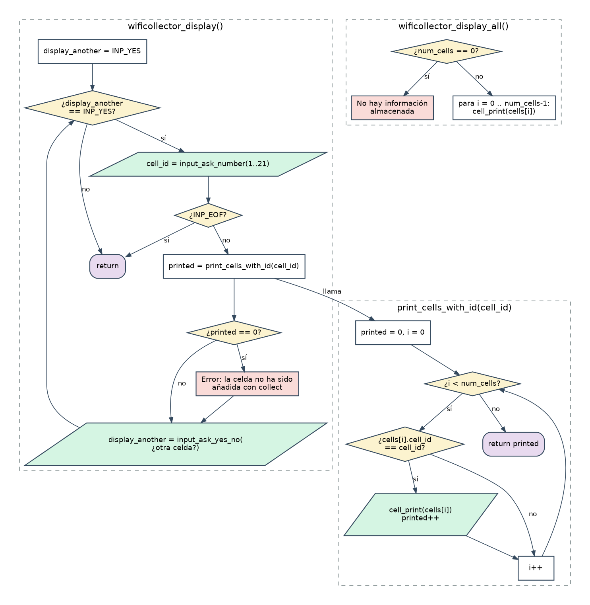

# Etapa 6 · `display` y `display_all`

> **Objetivo:** consultar lo que hay en el array: las celdas de un número concreto (`display`) o todas (`display_all`).
> **Dificultad:** baja. Es la etapa para consolidar. **Tiempo orientativo:** 1 sesión.

## 6.1 Teoría

### Búsqueda lineal

Para encontrar todos los elementos que cumplen una condición, se **recorre el array entero** comparando uno a uno. Con `num_cells` elementos ocupados, el recorrido es de `0` a `num_cells - 1`:

```c
for (i = 0; i < num_cells; i++)
{
	if (cells[i].cell_id == cell_id)
	{
		/* este punto de acceso es de la celda buscada */
	}
}
```

Recorre solo hasta `num_cells`, **no hasta 200**: las posiciones libres contienen basura.

### Una función que devuelve "cuántos"

`print_cells_with_id` imprime los que coinciden **y devuelve cuántos ha encontrado**. Quien la llama (`wificollector_display`) usa ese número para decidir si muestra el error "celda no recolectada". Así, la búsqueda y la decisión quedan separadas, y la función es fácil de entender y de reutilizar.

### Lo que dice el enunciado de `display`

- Si se pide una celda que no se ha añadido con `collect`: **mensaje de error**.
- **"En cualquier caso"** (con éxito o con error) hay que preguntar `"¿Desea imprimir la información de otra celda? [s/N]: "` y, si es `s`, repetir. Es decir, el error **no** interrumpe el bucle.

### Texto en dos líneas

El enunciado muestra la pregunta partida en dos líneas. Como la guía limita el ancho del código a 80 columnas, parte el literal en dos trozos adyacentes (C los pega) e incluye `\n` donde corresponda:

```c
"Indique el número de la celda de la que desea conocer su\n"
"información (1 - 21): "
```

## 6.2 Diagrama de flujo



## 6.3 Ficha: lo que debes escribir

**`wificollector.h`**: añade los prototipos de `wificollector_display` y `wificollector_display_all`.

**`wificollector.c`**:

| Función | Descripción |
|---|---|
| `static int print_cells_with_id(int cell_id)` | Imprime (con `cell_print`) los puntos de acceso guardados con ese `cell_id`. Devuelve cuántos imprimió |
| `void wificollector_display(void)` | Bucle: pide el número (1-21; si `INP_EOF`, `return`), imprime con la función anterior, y si no imprimió ninguno muestra un error. **Siempre** pregunta si se quiere consultar otra |
| `void wificollector_display_all(void)` | Si `num_cells == 0`, avisa de que no hay información. Si no, imprime todas **en orden de inserción** |

**`main.c`**: añade los `case` de `MNU_DISPLAY` y `MNU_DISPLAY_ALL`.

## 6.4 Pistas

> **Pista 1.** `wificollector_display` tiene la misma estructura que `wificollector_collect`: un bucle controlado por la respuesta sí/no. Copia **la forma**, no el texto: ya sabes escribirla.

> **Pista 2.** El mensaje de error de "celda no añadida" no es una pregunta: no hace falta `input_...` para él, basta un `printf`.

## 6.5 Pruebas

```
printf '2\n1\ns\n7\nn\n10\n9\n7\nn\n1\ns\n' | ./main
```

(Es el ejemplo completo del enunciado: collect 1 y 7, display_all, display de la 7, salir.)

| Prueba | Resultado esperado |
|---|---|
| `display_all` con el array vacío | Mensaje de "no hay información" |
| `display` de una celda **no** recolectada | Error, y **aun así** pregunta si se quiere otra |
| `display` de una celda con 3 puntos de acceso | Los 3, en el orden en que se añadieron |
| Recolectar la misma celda **dos veces** y `display` | Los puntos aparecen duplicados (decisión documentada en la portada) |
| `display` y Ctrl+D en mitad de la pregunta | Vuelve al menú y luego termina sin colgarse |

## 6.6 Errores típicos

- Recorrer hasta `WFC_MAX_CELLS` en vez de `num_cells`: imprime basura.
- Usar `=` en vez de `==` dentro del `if`.
- Olvidar la pregunta de "otra celda" cuando hay error (el enunciado dice "en cualquier caso").

## 6.7 Solución de referencia

<details>
<summary><strong>Ver mi solución: wificollector.h, wificollector.c y main.c</strong></summary>

**`etapa_6/wificollector.h`**

```c
#ifndef _WIFICOLLECTOR_H_
#define _WIFICOLLECTOR_H_

/* Pregunta si se quiere salir. Devuelve 1 si el usuario confirma, 0 si no */
int wificollector_quit(void);

/* Lee los puntos de acceso de ficheros info_cell_N.txt y los guarda */
void wificollector_collect(void);

/* Imprime los puntos de acceso guardados de la celda que elija el usuario */
void wificollector_display(void);

/* Imprime todos los puntos de acceso guardados */
void wificollector_display_all(void);

#endif /* _WIFICOLLECTOR_H_ */
```

**`etapa_6/wificollector.c`**

```c
#include <stdio.h>
#include "wificollector.h"
#include "cell.h"
#include "input.h"

/* Número de celda mínimo: corresponde al fichero info_cell_1.txt */
#define WFC_MIN_CELL_ID 1

/* Número de celda máximo: corresponde al fichero info_cell_21.txt */
#define WFC_MAX_CELL_ID 21

/* Número máximo de puntos de acceso que caben en el array */
#define WFC_MAX_CELLS 200

/* Tamaño máximo del nombre de un fichero (incluye el '\0' final) */
#define WFC_MAX_FILE_NAME 80

/* Variables globales (solo visibles dentro de este fichero) */

/* Array con los puntos de acceso recolectados hasta el momento */
static struct wifi_cell cells[WFC_MAX_CELLS];

/* Número de posiciones del array que están ocupadas */
static int num_cells = 0;

/*
 * wificollector_quit()
 * Pregunta al usuario si de verdad quiere salir del programa.
 * Devuelve 1 si el usuario confirma y 0 si decide seguir.
 */
int wificollector_quit(void)
{
	int answer;

	answer = input_ask_yes_no(
		"¿Está seguro de que desea salir del programa? [s/N]: ");

	if (answer == INP_YES)
	{
		printf("¡Hasta pronto!\n");
		return 1;
	}

	return 0;
}

/*
 * print_added_cell()
 * Confirma que se ha añadido un punto de acceso al array y lo imprime.
 */
static void print_added_cell(const char file_name[], int position)
{
	printf("Datos leídos de %s (añadidos a la posición %d del array)\n",
		file_name, position);
	cell_print(cells[position]);
	printf("\n");
}

/*
 * collect_one_cell()
 * Abre el fichero info_cell_N.txt y añade al array todos los puntos de acceso
 * que contiene, hasta que se acabe el fichero o se llene el array.
 */
static void collect_one_cell(int cell_id)
{
	char file_name[WFC_MAX_FILE_NAME];
	cell_read_status_t status = CEL_READ_OK;
	FILE *file;
	int added = 0;

	snprintf(file_name, WFC_MAX_FILE_NAME, "info_cell_%d.txt", cell_id);
	file = fopen(file_name, "r");
	if (file == NULL)
	{
		printf("Error: no se pudo abrir el fichero %s\n\n", file_name);
		return;
	}

	while (status == CEL_READ_OK && num_cells < WFC_MAX_CELLS)
	{
		status = cell_read_block(file, cells, num_cells);
		if (status == CEL_READ_OK)
		{
			print_added_cell(file_name, num_cells);
			num_cells++;
			added++;
		}
	}
	fclose(file);

	if (status == CEL_READ_ERROR)
	{
		printf("Error: formato incorrecto en %s (se ignora el resto)\n\n",
			file_name);
	}
	else if (status == CEL_READ_OK)
	{
		/* El bucle terminó con un bloque correcto: el array está lleno */
		printf("Aviso: el array está lleno (%d posiciones). No se añaden "
			"más datos.\n\n", WFC_MAX_CELLS);
	}
	else if (added == 0)
	{
		printf("El fichero %s no contiene datos\n\n", file_name);
	}
}

/*
 * wificollector_collect()
 * Pide un número de celda, añade al array los datos de su fichero y pregunta
 * si se quiere añadir otra celda. Repite mientras el usuario responda "s".
 */
void wificollector_collect(void)
{
	int cell_id;
	int add_another = INP_YES;

	while (add_another == INP_YES)
	{
		cell_id = input_ask_number("¿Qué celda quiere recolectar? (1 - 21): ",
			WFC_MIN_CELL_ID, WFC_MAX_CELL_ID);
		if (cell_id == INP_EOF)
		{
			return;
		}

		collect_one_cell(cell_id);

		add_another = input_ask_yes_no(
			"¿Desea añadir otro punto de acceso? [s/N]: ");
	}
}

/*
 * print_cells_with_id()
 * Imprime los puntos de acceso guardados cuyo identificador de celda es
 * "cell_id". Devuelve cuántos ha impreso.
 */
static int print_cells_with_id(int cell_id)
{
	int printed = 0;
	int i;

	for (i = 0; i < num_cells; i++)
	{
		if (cells[i].cell_id == cell_id)
		{
			cell_print(cells[i]);
			printed++;
		}
	}

	return printed;
}

/*
 * wificollector_display()
 * Pide un número de celda e imprime sus puntos de acceso guardados. Si no hay
 * ninguno, muestra un error. Después pregunta si se quiere consultar otra.
 */
void wificollector_display(void)
{
	int cell_id;
	int display_another = INP_YES;

	while (display_another == INP_YES)
	{
		cell_id = input_ask_number(
			"Indique el número de la celda de la que desea conocer su\n"
			"información (1 - 21): ", WFC_MIN_CELL_ID, WFC_MAX_CELL_ID);
		if (cell_id == INP_EOF)
		{
			return;
		}

		if (print_cells_with_id(cell_id) == 0)
		{
			printf("Error: la celda %d no ha sido añadida con "
				"wificollector_collect.\n", cell_id);
		}

		printf("\n");
		display_another = input_ask_yes_no(
			"¿Desea imprimir la información de otra celda? [s/N]: ");
	}
}

/*
 * wificollector_display_all()
 * Imprime todos los puntos de acceso guardados, en el orden en que se
 * añadieron.
 */
void wificollector_display_all(void)
{
	int i;

	if (num_cells == 0)
	{
		printf("No hay información almacenada. Use wificollector_collect.\n");
		return;
	}

	for (i = 0; i < num_cells; i++)
	{
		cell_print(cells[i]);
	}
}
```

**`etapa_6/main.c`**

```c
#include <stdio.h>
#include "input.h"
#include "wificollector.h"

/* Número de operaciones que muestra el menú principal */
#define MNU_NUM_OPTIONS 10

/*
 * menu_option_t
 * Operaciones del menú principal. El valor de cada una coincide con el número
 * que se muestra en pantalla (por eso la primera vale 1 y no 0).
 */
typedef enum
{
	MNU_QUIT = 1,
	MNU_COLLECT,
	MNU_SHOW_DATA_ONE_NETWORK,
	MNU_SELECT_BEST,
	MNU_DELETE_NET,
	MNU_SORT,
	MNU_EXPORT,
	MNU_IMPORT,
	MNU_DISPLAY,
	MNU_DISPLAY_ALL
} menu_option_t;

/*
 * print_menu()
 * Muestra por pantalla el menú principal con todas las operaciones.
 */
static void print_menu(void)
{
	printf("\n[2026] SAUCEM S.L. Recolector de redes inalámbricas\n\n");
	printf("    [ 1] wificollector_quit\n");
	printf("    [ 2] wificollector_collect\n");
	printf("    [ 3] wificollector_show_data_one_network\n");
	printf("    [ 4] wificollector_select_best\n");
	printf("    [ 5] wificollector_delete_net\n");
	printf("    [ 6] wificollector_sort\n");
	printf("    [ 7] wificollector_export\n");
	printf("    [ 8] wificollector_import\n");
	printf("    [ 9] wificollector_display\n");
	printf("    [10] wificollector_display_all\n\n");
}

/*
 * main()
 * Muestra el menú una y otra vez y ejecuta la operación elegida hasta que el
 * usuario confirma que quiere salir (o se acaba la entrada de datos).
 */
int main(void)
{
	int option;
	int exit_requested = 0;

	while (!exit_requested)
	{
		print_menu();
		option = input_ask_number("    Opción elegida: ", 1, MNU_NUM_OPTIONS);

		switch (option)
		{
			case INP_EOF:
				printf("\nFin de la entrada de datos.\n");
				exit_requested = 1;
				break;
			case MNU_QUIT:
				exit_requested = wificollector_quit();
				break;
			case MNU_COLLECT:
				wificollector_collect();
				break;
			case MNU_DISPLAY:
				wificollector_display();
				break;
			case MNU_DISPLAY_ALL:
				wificollector_display_all();
				break;
			default:
				printf("Esa operación todavía no está implementada.\n");
				break;
		}
	}

	return 0;
}
```

</details>

## 6.8 Recursos

- [`for`](https://en.cppreference.com/w/c/language/for) · [Búsqueda lineal](https://en.wikipedia.org/wiki/Linear_search)
- Beej's Guide to C: capítulo *Arrays*

## 6.9 Lista de comprobación

- [ ] El ejemplo completo del enunciado coincide
- [ ] Los datos de `display_all` salen en orden de inserción
- [ ] `display` pregunta "¿otra celda?" también tras un error
- [ ] Sé explicar por qué se recorre hasta `num_cells`
- [ ] He reescrito `print_cells_with_id` sin mirar
